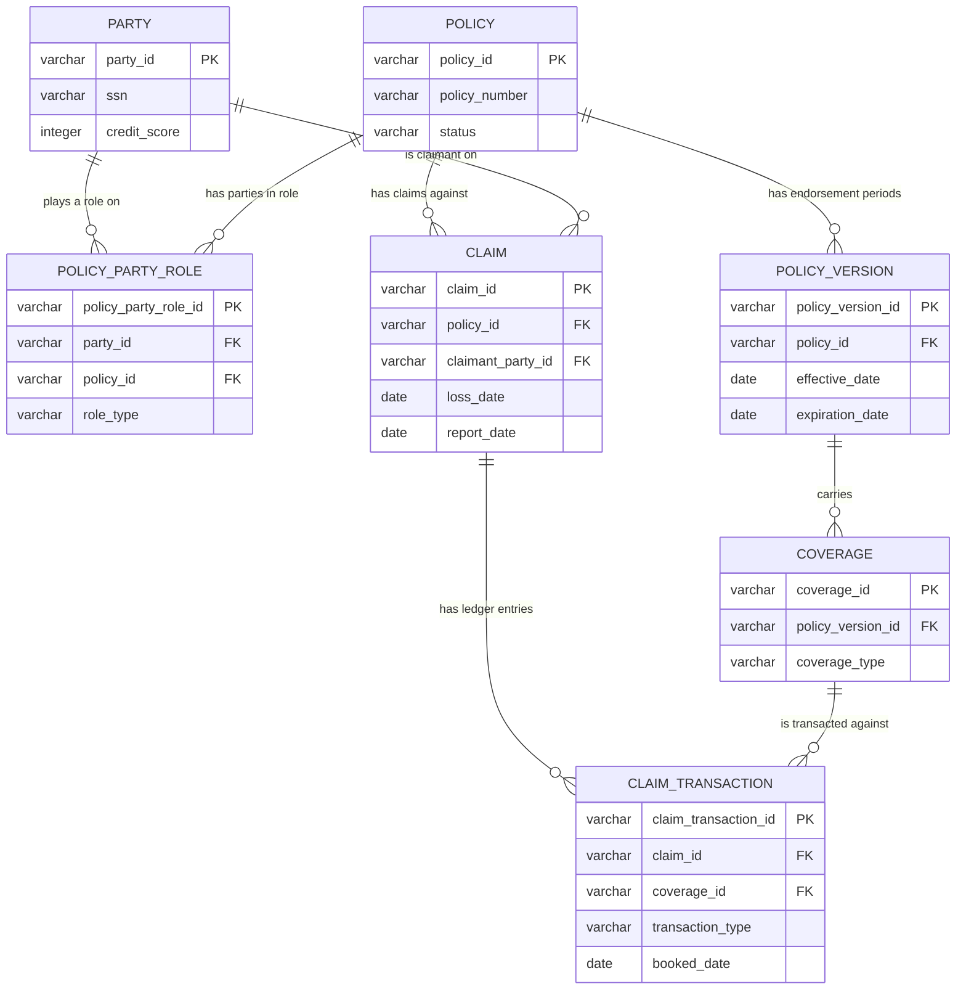
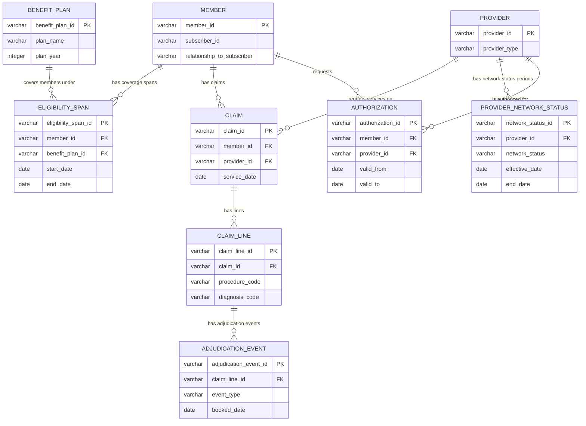

# Entity-relationship diagrams

One diagram per domain, matching ADR-0002's two-independent-stars decision — no merged diagram.

## P&C personal auto

```mermaid
erDiagram
    PARTY ||--o{ POLICY_PARTY_ROLE : "plays a role on"
    POLICY ||--o{ POLICY_PARTY_ROLE : "has parties in role"
    POLICY ||--o{ POLICY_VERSION : "has endorsement periods"
    POLICY_VERSION ||--o{ COVERAGE : "carries"
    POLICY ||--o{ CLAIM : "has claims against"
    PARTY ||--o{ CLAIM : "is claimant on"
    CLAIM ||--o{ CLAIM_TRANSACTION : "has ledger entries"
    COVERAGE ||--o{ CLAIM_TRANSACTION : "is transacted against"

    PARTY {
        varchar party_id PK
        varchar ssn
        integer credit_score
    }
    POLICY {
        varchar policy_id PK
        varchar policy_number
        varchar status
    }
    POLICY_VERSION {
        varchar policy_version_id PK
        varchar policy_id FK
        date effective_date
        date expiration_date
    }
    COVERAGE {
        varchar coverage_id PK
        varchar policy_version_id FK
        varchar coverage_type
    }
    POLICY_PARTY_ROLE {
        varchar policy_party_role_id PK
        varchar party_id FK
        varchar policy_id FK
        varchar role_type
    }
    CLAIM {
        varchar claim_id PK
        varchar policy_id FK
        varchar claimant_party_id FK
        date loss_date
        date report_date
    }
    CLAIM_TRANSACTION {
        varchar claim_transaction_id PK
        varchar claim_id FK
        varchar coverage_id FK
        varchar transaction_type
        date booked_date
    }
```

## Health

```mermaid
erDiagram
    MEMBER ||--o{ ELIGIBILITY_SPAN : "has coverage spans"
    BENEFIT_PLAN ||--o{ ELIGIBILITY_SPAN : "covers members under"
    MEMBER ||--o{ CLAIM : "has claims"
    PROVIDER ||--o{ CLAIM : "renders services on"
    PROVIDER ||--o{ PROVIDER_NETWORK_STATUS : "has network-status periods"
    CLAIM ||--o{ CLAIM_LINE : "has lines"
    CLAIM_LINE ||--o{ ADJUDICATION_EVENT : "has adjudication events"
    MEMBER ||--o{ AUTHORIZATION : "requests"
    PROVIDER ||--o{ AUTHORIZATION : "is authorized for"

    MEMBER {
        varchar member_id PK
        varchar subscriber_id
        varchar relationship_to_subscriber
    }
    ELIGIBILITY_SPAN {
        varchar eligibility_span_id PK
        varchar member_id FK
        varchar benefit_plan_id FK
        date start_date
        date end_date
    }
    BENEFIT_PLAN {
        varchar benefit_plan_id PK
        varchar plan_name
        integer plan_year
    }
    PROVIDER {
        varchar provider_id PK
        varchar provider_type
    }
    PROVIDER_NETWORK_STATUS {
        varchar network_status_id PK
        varchar provider_id FK
        varchar network_status
        date effective_date
        date end_date
    }
    CLAIM {
        varchar claim_id PK
        varchar member_id FK
        varchar provider_id FK
        date service_date
    }
    CLAIM_LINE {
        varchar claim_line_id PK
        varchar claim_id FK
        varchar procedure_code
        varchar diagnosis_code
    }
    ADJUDICATION_EVENT {
        varchar adjudication_event_id PK
        varchar claim_line_id FK
        varchar event_type
        date booked_date
    }
    AUTHORIZATION {
        varchar authorization_id PK
        varchar member_id FK
        varchar provider_id FK
        date valid_from
        date valid_to
    }
```
