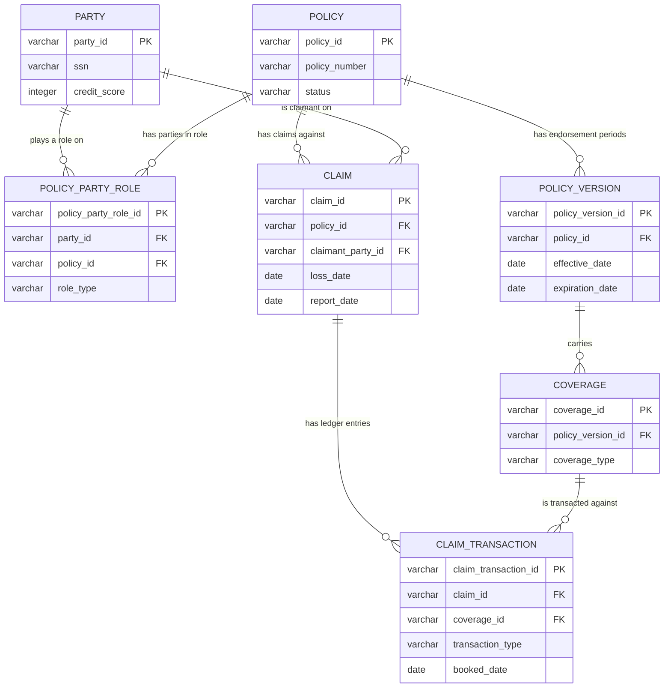
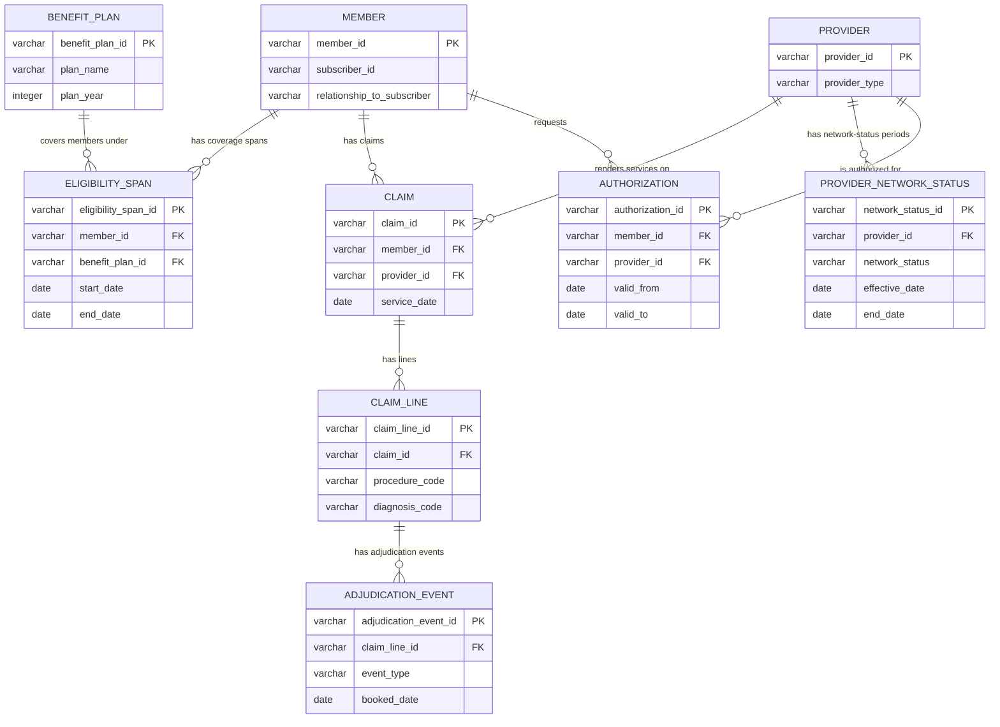

# Insurance Reference Model (dbt + DuckDB) Implementation Plan

> **For agentic workers:** REQUIRED SUB-SKILL: Use superpowers:subagent-driven-development (recommended) or superpowers:executing-plans to implement this plan task-by-task. Steps use checkbox (`- [ ]`) syntax for tracking.

**Goal:** Build `artifact/insurance-reference-model/` — a runnable dbt + DuckDB reference data
model, seeded with synthetic P&C personal-auto and health claims data, that demonstrates
bitemporal grain discipline (append-only transaction ledgers, SCD2 dimensions joined on
effective date, loss/development triangles from a `GROUP BY`) and a PII/PHI boundary enforced by
a dbt test.

**Architecture:** Two independent star schemas (P&C, health) sharing only `dim_date`, built as
`seeds → staging → marts` with native-DuckDB SQL (no dbt packages). SCD2 dimensions are regular
dbt models reading pre-versioned staging data, not dbt's native `snapshot` resource (see Deviation
1 below). Facts join SCD2 dimensions via a shared `as_of_join` macro on effective date ranges.

**Tech Stack:** dbt-core + dbt-duckdb, Python 3.11, `uv`-managed project environment, DuckDB file
database, GitHub Actions CI.

## Global Constraints

- Stays on the fork (`monocongo/cornerman`), branch `feature/data-ai-leadership-track`. Not part
  of any eventual upstream PR.
- Grain declared on every fact, in both the model's leading SQL comment and `schema.yml`
  `description`.
- Loss/development triangles fall out of a `GROUP BY` on an append-only ledger fact — no bespoke
  pipeline.
- SCD2 dimensions: facts join on effective-date range, never on `is_current`.
- PII/PHI boundary enforced by a dbt singular test, not a comment.
- `dbt build` (seed + run + test) must be green, locally and in CI, at the end of every task.
- Conventional commits; show the message and wait for approval before committing (user's global
  git-workflow rules). One commit per task below.
- Follow `~/.claude/CLAUDE.md` / `~/.claude/rules/python-style.md`: `uv run` not bare `python`,
  `uv add`/`uv sync`, `ruff check --fix` on any `.py` file touched (the two seed-generation
  scripts, run once and then discarded per Deviation 5 — no `.py` files are committed, so no ruff
  step applies to the committed artifact itself).

## Deviations from the design doc

The design doc (`docs/superpowers/specs/2026-08-09-insurance-reference-model-design.md`) is the
source of truth for scope and rationale. Six points needed a concrete resolution during planning
that the design doc left implicit or that turned out to be technically infeasible as literally
written. Each is a deliberate call, not a scope cut — flagging them here so they're visible before
execution starts, not discovered mid-build.

1. **SCD2 dimensions are regular dbt models, not dbt's native `snapshot` resource.** Decision 7 in
   the design doc calls for native `snapshot`, but dbt snapshots build history by diffing a
   *mutable* source across *multiple pipeline invocations over time* — they cannot retroactively
   materialize ~2 years of pre-known history from one seed load in a single `dbt build`. Since this
   artifact seeds already-known history (policy endorsements, provider network-status changes,
   benefit-plan years) and must build clean in one CI run, `dim_policy`, `dim_provider`, and
   `dim_benefit_plan` are built as regular models reading staging data that is *already*
   version-grained (one row per endorsement/status-change/plan-year, each with its own
   `effective_date`/`end_date`). This is documented as the primary technical call in
   ADR-0001.
2. **Seed CSVs are prefixed by domain** (`pnc_party.csv`, `health_claim.csv`, ...) rather than
   living in same-named files under separate directories. dbt names a seed after its file stem, not
   its directory — `seeds/pnc/claim.csv` and `seeds/health/claim.csv` would both produce a model
   named `claim` and collide on `ref('claim')`. Prefixing avoids the collision without extra
   `+alias` config.
3. **No `date_spine.csv` seed.** `dim_date` generates its own spine via DuckDB's
   `generate_series(date, date, interval)` — one self-contained model, nothing to hand-author or
   maintain.
4. **No `packages.yml`.** Composite/surrogate keys use DuckDB's native `md5()` instead of
   `dbt_utils`, so there's no external package dependency, no `dbt deps` step, and no lockfile to
   maintain.
5. **Row counts are tens-to-~150 rows per table**, not the design doc's "low thousands." Chosen for
   the same reason the design doc rejected a data generator in the pipeline: fast, free,
   deterministic, and a human can actually read the CSVs to verify correctness. Seed CSVs are
   authored via a one-time Python generation script (fixed random seed, full source given in Tasks
   3 and 11) that is **run once outside the repo, its output copied into `seeds/`, then discarded —
   it is never committed.** This keeps decision 2's own rationale ("no generator to maintain") intact
   while making ~600 rows of referentially-consistent data tractable to produce correctly.
6. **`fct_claim` and `fct_health_claim_line` deliberately do not carry a direct FK to "the version
   in effect."** The claim seed has no `policy_version_id` column; the claim-line seed has no
   network-status FK. Both facts instead resolve the applicable dimension row via `as_of_join` on
   `loss_date`/`service_date`. This is what actually exercises goal 3 (join on effective date, never
   `is_current`) rather than sidestepping it with a pre-resolved key. Relatedly, `fct_claim`'s grain
   is simplified to **one row per claim** (not "per header version" as the design doc's prose
   suggested) — claim-level status transitions, including reopen, are captured as
   `transaction_type` values in `fct_claim_transaction`'s ledger instead of a second, overlapping
   header-versioning mechanism for the same underlying lifecycle events.
7. **File placement:** `docs/` (ADRs, ERD) lives at `artifact/insurance-reference-model/docs/` as
   the design doc shows. The CI workflow lives at repo-root `.github/workflows/dbt-build.yml` —
   GitHub Actions only discovers workflows there, not nested under an arbitrary subdirectory.

## File Structure

```
cornerman/
  .github/workflows/dbt-build.yml
  artifact/insurance-reference-model/
    pyproject.toml
    profiles.yml
    dbt_project.yml
    .gitignore
    seeds/
      pnc/   pnc_party.csv, pnc_policy.csv, pnc_policy_version.csv, pnc_coverage.csv,
             pnc_claim.csv, pnc_claim_transaction.csv, pnc_policy_party_role.csv
      health/ health_member.csv, health_eligibility_span.csv, health_provider.csv,
              health_provider_network_status.csv, health_benefit_plan.csv, health_claim.csv,
              health_claim_line.csv, health_adjudication_event.csv, health_authorization.csv
    models/
      staging/
        pnc/    stg_pnc__party.sql ... stg_pnc__policy_party_role.sql, schema.yml
        health/ stg_health__member.sql ... stg_health__authorization.sql, schema.yml
      marts/
        shared/ dim_date.sql, schema.yml
        pnc/    dim_policy.sql, dim_coverage.sql, dim_insured.sql, fct_policy_party_role.sql,
                fct_claim.sql, fct_claim_transaction.sql, fct_premium_earned.sql, schema.yml
        health/ dim_provider.sql, dim_benefit_plan.sql, dim_member.sql, fct_eligibility_span.sql,
                fct_authorization.sql, fct_health_claim_line.sql, fct_adjudication_event.sql,
                schema.yml
    macros/as_of_join.sql
    tests/assert_fct_premium_earned_excludes_pii.sql
    tests/assert_fct_adjudication_event_excludes_phi.sql
    analyses/pnc_loss_triangle.sql, analyses/health_development_triangle.sql
    docs/ADR-0001-grain-and-temporality.md, ADR-0002-two-domains-not-conformed.md,
         ADR-0003-pii-phi-boundary.md, ERD.md
```

---

## Task 1: Scaffold the dbt + DuckDB project

**Files:**
- Create: `artifact/insurance-reference-model/pyproject.toml`
- Create: `artifact/insurance-reference-model/dbt_project.yml`
- Create: `artifact/insurance-reference-model/profiles.yml`
- Create: `artifact/insurance-reference-model/.gitignore`

**Interfaces:**
- Produces: a working `uv run dbt debug --profiles-dir .` from
  `artifact/insurance-reference-model/`, and the `insurance_reference_model` dbt project/profile
  name every later model's config relies on.

- [ ] **Step 1: Create the directory and `pyproject.toml`**

```bash
mkdir -p ~/git/cornerman/artifact/insurance-reference-model
cd ~/git/cornerman/artifact/insurance-reference-model
```

Write `pyproject.toml`:

```toml
[project]
name = "insurance-reference-model"
version = "0.1.0"
requires-python = ">=3.11"
dependencies = [
    "dbt-duckdb>=1.9.0,<2",
]
```

- [ ] **Step 2: `uv sync` and confirm dbt is installed**

```bash
cd ~/git/cornerman/artifact/insurance-reference-model
uv sync
uv run dbt --version
```

Expected: prints `dbt-core` and `dbt-duckdb` versions, no error.

- [ ] **Step 3: Write `dbt_project.yml`**

```yaml
name: 'insurance_reference_model'
version: '1.0.0'
config-version: 2
profile: 'insurance_reference_model'

model-paths: ["models"]
seed-paths: ["seeds"]
macro-paths: ["macros"]
test-paths: ["tests"]
analysis-paths: ["analyses"]
target-path: "target"
clean-targets: ["target", "dbt_packages"]

seeds:
  insurance_reference_model:
    +schema: seed
    pnc:
      +schema: seed_pnc
    health:
      +schema: seed_health

models:
  insurance_reference_model:
    staging:
      +materialized: view
      pnc:
        +schema: staging_pnc
      health:
        +schema: staging_health
    marts:
      +materialized: table
      shared:
        +schema: marts
      pnc:
        +schema: marts_pnc
      health:
        +schema: marts_health
```

- [ ] **Step 4: Write `profiles.yml`**

```yaml
insurance_reference_model:
  target: dev
  outputs:
    dev:
      type: duckdb
      path: 'insurance_reference_model.duckdb'
      threads: 4
```

- [ ] **Step 5: Write `.gitignore`**

```
.venv/
target/
dbt_packages/
logs/
*.duckdb
*.duckdb.wal
```

- [ ] **Step 6: Verify `dbt debug` passes**

```bash
cd ~/git/cornerman/artifact/insurance-reference-model
uv run dbt debug --profiles-dir .
```

Expected: `All checks passed!` (there are no models/seeds yet, so this only validates the
connection and project config).

- [ ] **Step 7: Commit**

```bash
cd ~/git/cornerman
git add artifact/insurance-reference-model/pyproject.toml \
        artifact/insurance-reference-model/uv.lock \
        artifact/insurance-reference-model/dbt_project.yml \
        artifact/insurance-reference-model/profiles.yml \
        artifact/insurance-reference-model/.gitignore
git commit -m "chore: scaffold dbt + DuckDB project for insurance reference model"
```

---

## Task 2: Shared `dim_date`

**Files:**
- Create: `artifact/insurance-reference-model/models/marts/shared/dim_date.sql`
- Create: `artifact/insurance-reference-model/models/marts/shared/schema.yml`

**Interfaces:**
- Consumes: nothing (self-contained; no seed dependency, per Deviation 3).
- Produces: `ref('dim_date')` with columns `date_day (date, PK)`, `year_number (integer)`,
  `quarter_number (integer)`, `month_number (integer)`, `month_name (varchar)`,
  `day_of_month (integer)`, `day_of_week_number (integer)`, `day_name (varchar)`,
  `is_weekend (boolean)`. Used later by `fct_premium_earned` (Task 10).

- [ ] **Step 1: Write `dim_date.sql`**

```sql
-- Grain: one row per calendar day, 2023-01-01 through 2026-12-31.
with spine as (
    select unnest(generate_series(
        date '2023-01-01', date '2026-12-31', interval 1 day
    )) as date_day
)

select
    date_day,
    extract(year from date_day)::integer as year_number,
    extract(quarter from date_day)::integer as quarter_number,
    extract(month from date_day)::integer as month_number,
    strftime(date_day, '%B') as month_name,
    extract(day from date_day)::integer as day_of_month,
    extract(dow from date_day)::integer as day_of_week_number,
    strftime(date_day, '%A') as day_name,
    (extract(dow from date_day) in (0, 6)) as is_weekend
from spine
```

- [ ] **Step 2: Write `schema.yml`**

```yaml
version: 2

models:
  - name: dim_date
    description: "Grain: one row per calendar day, 2023-01-01 through 2026-12-31. The only model shared across the P&C and health domains."
    config:
      contract:
        enforced: true
    columns:
      - name: date_day
        data_type: date
        tests: [not_null, unique]
      - name: year_number
        data_type: integer
        tests: [not_null]
      - name: quarter_number
        data_type: integer
        tests: [not_null]
      - name: month_number
        data_type: integer
        tests: [not_null]
      - name: month_name
        data_type: varchar
        tests: [not_null]
      - name: day_of_month
        data_type: integer
        tests: [not_null]
      - name: day_of_week_number
        data_type: integer
        tests: [not_null]
      - name: day_name
        data_type: varchar
        tests: [not_null]
      - name: is_weekend
        data_type: boolean
        tests: [not_null]
```

- [ ] **Step 3: Run and test**

```bash
cd ~/git/cornerman/artifact/insurance-reference-model
uv run dbt run --select dim_date --profiles-dir .
uv run dbt test --select dim_date --profiles-dir .
```

Expected: both green; `dim_date` has 1461 rows (4 years incl. two leap years, 2024 and none other
— 365*3 + 366 = 1461).

- [ ] **Step 4: Commit**

```bash
cd ~/git/cornerman
git add artifact/insurance-reference-model/models/marts/shared/
git commit -m "feat: add shared dim_date model"
```

---

## Task 3: Generate and commit P&C seed data

**Files:**
- Create (scratch, not committed): a Python script run once to produce the CSVs below.
- Create: `artifact/insurance-reference-model/seeds/pnc/pnc_party.csv`
- Create: `artifact/insurance-reference-model/seeds/pnc/pnc_policy.csv`
- Create: `artifact/insurance-reference-model/seeds/pnc/pnc_policy_version.csv`
- Create: `artifact/insurance-reference-model/seeds/pnc/pnc_coverage.csv`
- Create: `artifact/insurance-reference-model/seeds/pnc/pnc_policy_party_role.csv`
- Create: `artifact/insurance-reference-model/seeds/pnc/pnc_claim.csv`
- Create: `artifact/insurance-reference-model/seeds/pnc/pnc_claim_transaction.csv`

**Interfaces:**
- Produces: 7 seed tables, `ref('pnc_party')` through `ref('pnc_claim_transaction')`, consumed by
  the Task 4 staging models. Exact column lists are in the header rows the script writes below —
  Task 4's staging models depend on these exact names.

- [ ] **Step 1: Write and run the generation script in the scratchpad**

Save as `/private/tmp/claude-501/-Users-jadams/1e9f8ec4-6036-4793-a574-725b9bf6775e/scratchpad/generate_pnc_seeds.py`
(or any scratch location — this file is never committed):

```python
#!/usr/bin/env python3
"""One-time authoring script for the P&C seed CSVs (cornerman task 5).
Run once, copy the output CSVs into artifact/insurance-reference-model/seeds/pnc/, then
discard this script. It is not part of the dbt project."""
import csv
import random
from datetime import date, timedelta

random.seed(42)

STATES = ["CO", "TX", "AZ", "UT", "NM"]
FIRST_NAMES = ["James", "Mary", "Robert", "Patricia", "John", "Jennifer", "Michael", "Linda",
               "David", "Elizabeth", "William", "Barbara", "Richard", "Susan", "Joseph",
               "Jessica", "Thomas", "Sarah", "Charles", "Karen", "Daniel", "Nancy", "Matthew",
               "Lisa", "Anthony", "Betty", "Mark", "Margaret", "Donald", "Sandra"]
LAST_NAMES = ["Smith", "Johnson", "Williams", "Brown", "Jones", "Garcia", "Miller", "Davis",
              "Rodriguez", "Martinez", "Hernandez", "Lopez", "Gonzalez", "Wilson", "Anderson",
              "Thomas", "Taylor", "Moore", "Jackson", "Martin"]
COVERAGE_TYPES = ["bodily_injury_liability", "property_damage_liability", "collision", "comprehensive"]
LOSS_TYPE_BY_COVERAGE = {
    "bodily_injury_liability": "liability_bi",
    "property_damage_liability": "liability_pd",
    "collision": "collision",
    "comprehensive": "comprehensive",
}


def rand_date(start, end):
    return start + timedelta(days=random.randint(0, (end - start).days))


def write_csv(filename, header, rows):
    with open(filename, "w", newline="") as f:
        w = csv.writer(f)
        w.writerow(header)
        w.writerows(rows)


# --- party ---
party_ids = [f"PT-{i:04d}" for i in range(1, 31)]
party_rows = []
for pid in party_ids:
    dob = rand_date(date(1955, 1, 1), date(2004, 12, 31))
    created = rand_date(date(2022, 1, 1), date(2023, 12, 31))
    party_rows.append([
        pid, random.choice(FIRST_NAMES), random.choice(LAST_NAMES), dob.isoformat(),
        f"{random.randint(100, 999)}-{random.randint(10, 99)}-{random.randint(1000, 9999)}",
        random.randint(580, 830), random.choice(STATES), created.isoformat(),
    ])

# --- policy, policy_version, coverage ---
policy_rows, version_rows, coverage_rows = [], [], []
policy_owner = {}
policy_versions = {}
version_seq = 0
coverage_seq = 0

for i in range(1, 21):
    policy_id = f"POL-{i:04d}"
    named_insured = party_ids[(i - 1) % len(party_ids)]
    policy_owner[policy_id] = named_insured
    orig_eff = rand_date(date(2023, 7, 1), date(2024, 6, 30))
    term_end_1 = orig_eff + timedelta(days=182)
    term_end_2 = term_end_1 + timedelta(days=182)
    n_versions = random.choices([1, 2, 3], weights=[30, 45, 25])[0]

    if n_versions == 1:
        spans = [("new_business", orig_eff, term_end_1)]
    elif n_versions == 2:
        if random.random() < 0.5:
            mid = orig_eff + timedelta(days=random.randint(30, 150))
            reason = random.choice(["endorsement_add_driver", "endorsement_coverage_change",
                                     "endorsement_address_change"])
            spans = [("new_business", orig_eff, mid), (reason, mid, term_end_1)]
        else:
            spans = [("new_business", orig_eff, term_end_1), ("renewal", term_end_1, term_end_2)]
    else:
        mid = orig_eff + timedelta(days=random.randint(30, 150))
        reason = random.choice(["endorsement_add_driver", "endorsement_coverage_change",
                                 "endorsement_address_change"])
        spans = [("new_business", orig_eff, mid), (reason, mid, term_end_1),
                 ("renewal", term_end_1, term_end_2)]

    versions_for_policy = []
    for v_idx, (reason, v_start, v_end) in enumerate(spans, start=1):
        version_seq += 1
        version_id = f"PV-{version_seq:05d}"
        premium = round(random.uniform(450, 1400), 2)
        garaging_state = random.choice(STATES)
        version_rows.append([version_id, policy_id, v_idx, reason, v_start.isoformat(),
                              v_end.isoformat(), premium, garaging_state])
        versions_for_policy.append((version_id, v_start, v_end))
        for cov_type in COVERAGE_TYPES:
            coverage_seq += 1
            coverage_rows.append([
                f"COV-{coverage_seq:05d}", version_id, cov_type,
                random.choice([25000, 50000, 100000, 250000]),
                random.choice([250, 500, 1000]),
            ])
    policy_versions[policy_id] = versions_for_policy

    status = "active"
    if random.random() < 0.1:
        status = "cancelled"
    elif n_versions == 1 and random.random() < 0.25:
        status = "non_renewed"
    policy_rows.append([
        policy_id, f"PN-{100000 + i}", "personal_auto", orig_eff.isoformat(),
        spans[0][1].isoformat(), spans[-1][2].isoformat(), status,
    ])

# --- policy_party_role ---
role_rows = []
role_seq = 0
for policy_id, named_insured in policy_owner.items():
    role_seq += 1
    first_start = policy_versions[policy_id][0][1]
    role_rows.append([f"ROLE-{role_seq:05d}", named_insured, policy_id, "", "named_insured",
                       first_start.isoformat(), ""])
    if random.random() < 0.4:
        other = random.choice([p for p in party_ids if p != named_insured])
        role_seq += 1
        role_rows.append([f"ROLE-{role_seq:05d}", other, policy_id, "", "driver",
                           first_start.isoformat(), ""])

# --- claim, claim_transaction ---
claim_rows, txn_rows = [], []
txn_seq = 0
active_policy_ids = list(policy_owner.keys())
for c_idx in range(1, 21):
    claim_id = f"CLM-{c_idx:04d}"
    policy_id = random.choice(active_policy_ids)
    loss_date = rand_date(date(2024, 1, 1), date(2025, 10, 31))
    covering = [v for v in policy_versions[policy_id] if v[1] <= loss_date < v[2]]
    version = covering[0] if covering else policy_versions[policy_id][-1]
    version_coverages = [c for c in coverage_rows if c[1] == version[0]]
    coverage = random.choice(version_coverages)
    loss_type = LOSS_TYPE_BY_COVERAGE[coverage[2]]
    report_lag = random.choices([0, 1, 3, 7, 21, 60], weights=[30, 25, 20, 15, 7, 3])[0]
    report_date = loss_date + timedelta(days=report_lag)
    claimant = policy_owner[policy_id]
    n_txns = random.randint(2, 6)
    status = "closed" if random.random() < 0.6 else "open"
    claim_rows.append([claim_id, policy_id, claimant, loss_date.isoformat(),
                        report_date.isoformat(), loss_type, status,
                        "true" if random.random() < 0.05 else "false"])

    booked = report_date
    reserve = round(random.uniform(1500, 18000), 2)
    txn_seq += 1
    txn_rows.append([f"TXN-{txn_seq:05d}", claim_id, coverage[0], "reserve_set",
                      booked.isoformat(), reserve])
    for _ in range(n_txns - 1):
        booked = booked + timedelta(days=random.randint(10, 75))
        kind = random.choices(
            ["reserve_change", "payment_issued", "payment_voided", "reopened"],
            weights=[25, 55, 5, 5],
        )[0]
        if kind == "reserve_change":
            reserve = round(reserve * random.uniform(0.8, 1.3), 2)
            amount = reserve
        elif kind == "payment_issued":
            amount = round(reserve * random.uniform(0.2, 0.6), 2)
        elif kind == "payment_voided":
            amount = round(reserve * random.uniform(0.05, 0.2), 2)
        else:
            amount = 0.0
        txn_seq += 1
        txn_rows.append([f"TXN-{txn_seq:05d}", claim_id, coverage[0], kind,
                          booked.isoformat(), amount])

write_csv("pnc_party.csv",
          ["party_id", "first_name", "last_name", "date_of_birth", "ssn", "credit_score",
           "state", "created_date"], party_rows)
write_csv("pnc_policy.csv",
          ["policy_id", "policy_number", "line_of_business", "original_effective_date",
           "current_term_start", "current_term_end", "status"], policy_rows)
write_csv("pnc_policy_version.csv",
          ["policy_version_id", "policy_id", "version_number", "change_reason",
           "effective_date", "expiration_date", "term_premium_amount", "garaging_state"],
          version_rows)
write_csv("pnc_coverage.csv",
          ["coverage_id", "policy_version_id", "coverage_type", "limit_amount",
           "deductible_amount"], coverage_rows)
write_csv("pnc_policy_party_role.csv",
          ["policy_party_role_id", "party_id", "policy_id", "claim_id", "role_type",
           "effective_date", "end_date"], role_rows)
write_csv("pnc_claim.csv",
          ["claim_id", "policy_id", "claimant_party_id", "loss_date", "report_date",
           "loss_type", "status", "catastrophe_flag"], claim_rows)
write_csv("pnc_claim_transaction.csv",
          ["claim_transaction_id", "claim_id", "coverage_id", "transaction_type",
           "booked_date", "amount"], txn_rows)

print(f"party={len(party_rows)} policy={len(policy_rows)} policy_version={len(version_rows)} "
      f"coverage={len(coverage_rows)} policy_party_role={len(role_rows)} claim={len(claim_rows)} "
      f"claim_transaction={len(txn_rows)}")
```

Run it from the scratch directory:

```bash
cd /private/tmp/claude-501/-Users-jadams/1e9f8ec4-6036-4793-a574-725b9bf6775e/scratchpad
uv run --python 3.11 --with-requirements /dev/null python generate_pnc_seeds.py
```

(Any Python 3.11+ interpreter works — the script has no third-party dependencies.)

- [ ] **Step 2: Inspect output row counts and a few rows for sanity**

```bash
wc -l pnc_*.csv
head -5 pnc_policy_version.csv pnc_claim_transaction.csv
```

Expected: 7 files, roughly party=30, policy=20, policy_version≈45, coverage≈180,
policy_party_role≈28, claim=20, claim_transaction≈80 (each +1 for the header row). Spot-check that
`pnc_policy_version.csv` effective/expiration dates are chronologically increasing per policy_id
and that `pnc_claim.csv` loss_date values fall inside 2024–2025.

- [ ] **Step 3: Copy the CSVs into the repo and discard the script**

```bash
mkdir -p ~/git/cornerman/artifact/insurance-reference-model/seeds/pnc
cp pnc_*.csv ~/git/cornerman/artifact/insurance-reference-model/seeds/pnc/
rm generate_pnc_seeds.py
```

- [ ] **Step 4: Seed and verify**

```bash
cd ~/git/cornerman/artifact/insurance-reference-model
uv run dbt seed --select pnc --profiles-dir .
```

Expected: 7 seeds loaded, no errors.

- [ ] **Step 5: Commit**

```bash
cd ~/git/cornerman
git add artifact/insurance-reference-model/seeds/pnc/
git commit -m "feat: add synthetic P&C seed data"
```

---

## Task 4: P&C staging models

**Files:**
- Create: `artifact/insurance-reference-model/models/staging/pnc/stg_pnc__party.sql`
- Create: `artifact/insurance-reference-model/models/staging/pnc/stg_pnc__policy.sql`
- Create: `artifact/insurance-reference-model/models/staging/pnc/stg_pnc__policy_version.sql`
- Create: `artifact/insurance-reference-model/models/staging/pnc/stg_pnc__coverage.sql`
- Create: `artifact/insurance-reference-model/models/staging/pnc/stg_pnc__policy_party_role.sql`
- Create: `artifact/insurance-reference-model/models/staging/pnc/stg_pnc__claim.sql`
- Create: `artifact/insurance-reference-model/models/staging/pnc/stg_pnc__claim_transaction.sql`
- Create: `artifact/insurance-reference-model/models/staging/pnc/schema.yml`

**Interfaces:**
- Consumes: `ref('pnc_party')` ... `ref('pnc_claim_transaction')` from Task 3.
- Produces: `ref('stg_pnc__party')` ... `ref('stg_pnc__claim_transaction')`, typed and with
  nullable-empty-string columns converted to real SQL `NULL`. Consumed by Tasks 5–10.

- [ ] **Step 1: Write the 7 staging models**

`stg_pnc__party.sql`:
```sql
select
    party_id,
    first_name,
    last_name,
    date_of_birth::date as date_of_birth,
    ssn,
    credit_score::integer as credit_score,
    state,
    created_date::date as created_date
from {{ ref('pnc_party') }}
```

`stg_pnc__policy.sql`:
```sql
select
    policy_id,
    policy_number,
    line_of_business,
    original_effective_date::date as original_effective_date,
    current_term_start::date as current_term_start,
    current_term_end::date as current_term_end,
    status
from {{ ref('pnc_policy') }}
```

`stg_pnc__policy_version.sql`:
```sql
select
    policy_version_id,
    policy_id,
    version_number::integer as version_number,
    change_reason,
    effective_date::date as effective_date,
    expiration_date::date as expiration_date,
    term_premium_amount::decimal(10, 2) as term_premium_amount,
    garaging_state
from {{ ref('pnc_policy_version') }}
```

`stg_pnc__coverage.sql`:
```sql
select
    coverage_id,
    policy_version_id,
    coverage_type,
    limit_amount::decimal(12, 2) as limit_amount,
    deductible_amount::decimal(10, 2) as deductible_amount
from {{ ref('pnc_coverage') }}
```

`stg_pnc__policy_party_role.sql`:
```sql
select
    policy_party_role_id,
    party_id,
    nullif(policy_id, '') as policy_id,
    nullif(claim_id, '') as claim_id,
    role_type,
    effective_date::date as effective_date,
    nullif(end_date, '')::date as end_date
from {{ ref('pnc_policy_party_role') }}
```

`stg_pnc__claim.sql`:
```sql
select
    claim_id,
    policy_id,
    claimant_party_id,
    loss_date::date as loss_date,
    report_date::date as report_date,
    loss_type,
    status,
    catastrophe_flag::boolean as catastrophe_flag
from {{ ref('pnc_claim') }}
```

`stg_pnc__claim_transaction.sql`:
```sql
select
    claim_transaction_id,
    claim_id,
    coverage_id,
    transaction_type,
    booked_date::date as booked_date,
    amount::decimal(12, 2) as amount
from {{ ref('pnc_claim_transaction') }}
```

- [ ] **Step 2: Write `schema.yml`**

```yaml
version: 2

models:
  - name: stg_pnc__party
    description: "Grain: one row per party."
    columns:
      - name: party_id
        tests: [not_null, unique]

  - name: stg_pnc__policy
    description: "Grain: one row per policy (stable policy_number across renewals)."
    columns:
      - name: policy_id
        tests: [not_null, unique]

  - name: stg_pnc__policy_version
    description: "Grain: one row per policy per endorsement-effective period."
    columns:
      - name: policy_version_id
        tests: [not_null, unique]
      - name: policy_id
        tests:
          - not_null
          - relationships:
              arguments:
                to: ref('stg_pnc__policy')
                field: policy_id

  - name: stg_pnc__coverage
    description: "Grain: one row per policy version per coverage type."
    columns:
      - name: coverage_id
        tests: [not_null, unique]
      - name: policy_version_id
        tests:
          - not_null
          - relationships:
              arguments:
                to: ref('stg_pnc__policy_version')
                field: policy_version_id
      - name: coverage_type
        tests:
          - accepted_values:
              values: ['bodily_injury_liability', 'property_damage_liability', 'collision', 'comprehensive']

  - name: stg_pnc__policy_party_role
    description: "Grain: one row per party per policy-or-claim per role."
    columns:
      - name: policy_party_role_id
        tests: [not_null, unique]
      - name: party_id
        tests:
          - not_null
          - relationships:
              arguments:
                to: ref('stg_pnc__party')
                field: party_id
      - name: policy_id
        tests:
          - relationships:
              arguments:
                to: ref('stg_pnc__policy')
                field: policy_id
      - name: role_type
        tests:
          - accepted_values:
              values: ['named_insured', 'additional_insured', 'driver', 'claimant', 'beneficiary']

  - name: stg_pnc__claim
    description: "Grain: one row per claim."
    columns:
      - name: claim_id
        tests: [not_null, unique]
      - name: policy_id
        tests:
          - not_null
          - relationships:
              arguments:
                to: ref('stg_pnc__policy')
                field: policy_id
      - name: claimant_party_id
        tests:
          - relationships:
              arguments:
                to: ref('stg_pnc__party')
                field: party_id
      - name: status
        tests:
          - accepted_values:
              values: ['open', 'closed']

  - name: stg_pnc__claim_transaction
    description: "Grain: one row per claim per coverage per transaction per booked_date."
    columns:
      - name: claim_transaction_id
        tests: [not_null, unique]
      - name: claim_id
        tests:
          - not_null
          - relationships:
              arguments:
                to: ref('stg_pnc__claim')
                field: claim_id
      - name: coverage_id
        tests:
          - not_null
          - relationships:
              arguments:
                to: ref('stg_pnc__coverage')
                field: coverage_id
      - name: transaction_type
        tests:
          - accepted_values:
              values: ['reserve_set', 'reserve_change', 'payment_issued', 'payment_voided', 'reopened']
```

- [ ] **Step 3: Run and test**

```bash
cd ~/git/cornerman/artifact/insurance-reference-model
uv run dbt run --select staging.pnc --profiles-dir .
uv run dbt test --select staging.pnc --profiles-dir .
```

Expected: 7 models built, all tests green. If `claim.status` accepted_values fails, check the
generation script's `status` field only ever writes `"open"`/`"closed"` (it does — no `"reopened"`
status literal is written to `pnc_claim.csv`; reopening shows up as a `claim_transaction` event
instead, per Deviation 6).

- [ ] **Step 4: Commit**

```bash
cd ~/git/cornerman
git add artifact/insurance-reference-model/models/staging/pnc/
git commit -m "feat: add P&C staging models"
```

---

## Task 5: `as_of_join` macro + P&C SCD2 dimensions

**Files:**
- Create: `artifact/insurance-reference-model/macros/as_of_join.sql`
- Create: `artifact/insurance-reference-model/models/marts/pnc/dim_policy.sql`
- Create: `artifact/insurance-reference-model/models/marts/pnc/dim_coverage.sql`
- Create: `artifact/insurance-reference-model/models/marts/pnc/schema.yml`

**Interfaces:**
- Consumes: `ref('stg_pnc__policy')`, `ref('stg_pnc__policy_version')`, `ref('stg_pnc__coverage')`.
- Produces: the `as_of_join(fact_alias, fact_date_column, dim_relation, dim_alias, key_columns,
  valid_from_column='valid_from', valid_to_column='valid_to')` macro, called directly by Tasks 8
  and 17 (fact rows joining an SCD2 dimension on an already-known date). Task 10
  (`fct_premium_earned`) does **not** call this macro — it is a window-expansion accrual fact
  that generates its own calendar rows from `dim_policy`/`dim_coverage`'s `valid_from`/`valid_to`
  windows, a different but equally valid temporal pattern; see Task 10's model comment. Produces
  `ref('dim_policy')` keyed on `policy_version_id` with `valid_from`/`valid_to`/`is_current`, and
  `ref('dim_coverage')` keyed on `coverage_id`, both consumed by Tasks 8–10.

- [ ] **Step 1: Write the macro**

```sql

left join {{ dim_relation }} as {{ dim_alias }}
    on {{ fact_alias }}.{{ col }} = {{ dim_alias }}.{{ col }} and 

    and {{ fact_alias }}.{{ fact_date_column }} >= {{ dim_alias }}.{{ valid_from_column }}
    and ({{ fact_alias }}.{{ fact_date_column }} < {{ dim_alias }}.{{ valid_to_column }} or {{ dim_alias }}.{{ valid_to_column }} is null)

```

- [ ] **Step 2: Write `dim_policy.sql`**

```sql
-- Grain: one row per policy per endorsement-effective period (policy_version_id).
-- SCD2-shaped: valid_from/valid_to define the effective window; is_current flags the latest
-- version per policy. Built as a regular model reading pre-versioned staging data rather than
-- dbt's native `snapshot` resource -- see ADR-0001 for why.
select
    pv.policy_version_id,
    pv.policy_id,
    p.policy_number,
    p.line_of_business,
    p.status as policy_status,
    pv.version_number,
    pv.change_reason,
    pv.term_premium_amount,
    pv.garaging_state,
    pv.effective_date as valid_from,
    pv.expiration_date as valid_to,
    (
        pv.expiration_date = (
            select max(pv2.expiration_date)
            from {{ ref('stg_pnc__policy_version') }} pv2
            where pv2.policy_id = pv.policy_id
        )
    ) as is_current
from {{ ref('stg_pnc__policy_version') }} pv
join {{ ref('stg_pnc__policy') }} p on pv.policy_id = p.policy_id
```

- [ ] **Step 3: Write `dim_coverage.sql`**

```sql
-- Grain: one row per policy version per coverage type (coverage_id). Inherits its policy
-- version's effective window.
select
    c.coverage_id,
    c.policy_version_id,
    dp.policy_id,
    c.coverage_type,
    c.limit_amount,
    c.deductible_amount,
    dp.valid_from,
    dp.valid_to,
    dp.is_current
from {{ ref('stg_pnc__coverage') }} c
join {{ ref('dim_policy') }} dp on c.policy_version_id = dp.policy_version_id
```

- [ ] **Step 4: Write `schema.yml`** (this file grows across Tasks 5–10; write only the two
  models below now)

```yaml
version: 2

models:
  - name: dim_policy
    description: "Grain: one row per policy per endorsement-effective period."
    config:
      contract:
        enforced: true
    columns:
      - name: policy_version_id
        data_type: varchar
        tests: [not_null, unique]
      - name: policy_id
        data_type: varchar
        tests: [not_null]
      - name: policy_number
        data_type: varchar
        tests: [not_null]
      - name: line_of_business
        data_type: varchar
        tests: [not_null]
      - name: policy_status
        data_type: varchar
        tests: [not_null]
      - name: version_number
        data_type: integer
        tests: [not_null]
      - name: change_reason
        data_type: varchar
        tests: [not_null]
      - name: term_premium_amount
        data_type: decimal(10,2)
        tests: [not_null]
      - name: garaging_state
        data_type: varchar
        tests: [not_null]
      - name: valid_from
        data_type: date
        tests: [not_null]
      - name: valid_to
        data_type: date
      - name: is_current
        data_type: boolean
        tests: [not_null]

  - name: dim_coverage
    description: "Grain: one row per policy version per coverage type."
    config:
      contract:
        enforced: true
    columns:
      - name: coverage_id
        data_type: varchar
        tests: [not_null, unique]
      - name: policy_version_id
        data_type: varchar
        tests:
          - not_null
          - relationships:
              arguments:
                to: ref('dim_policy')
                field: policy_version_id
      - name: policy_id
        data_type: varchar
        tests: [not_null]
      - name: coverage_type
        data_type: varchar
        tests: [not_null]
      - name: limit_amount
        data_type: decimal(12,2)
        tests: [not_null]
      - name: deductible_amount
        data_type: decimal(10,2)
        tests: [not_null]
      - name: valid_from
        data_type: date
        tests: [not_null]
      - name: valid_to
        data_type: date
      - name: is_current
        data_type: boolean
        tests: [not_null]
```

- [ ] **Step 5: Run and test**

```bash
cd ~/git/cornerman/artifact/insurance-reference-model
uv run dbt run --select dim_policy dim_coverage --profiles-dir .
uv run dbt test --select dim_policy dim_coverage --profiles-dir .
```

Expected: both models build, all tests green, and each policy has exactly one row with
`is_current = true` — spot-check with:

```bash
uv run dbt show --select dim_policy --profiles-dir . -- \
  --limit 0
```

(or query directly: `select policy_id, count(*) from dim_policy where is_current group by 1 having count(*) <> 1;` should return zero rows via the DuckDB CLI against `insurance_reference_model.duckdb`.)

- [ ] **Step 6: Commit**

```bash
cd ~/git/cornerman
git add artifact/insurance-reference-model/macros/ artifact/insurance-reference-model/models/marts/pnc/
git commit -m "feat: add as_of_join macro and P&C SCD2 dimensions"
```

---

## Task 6: `dim_insured`

**Files:**
- Create: `artifact/insurance-reference-model/models/marts/pnc/dim_insured.sql`
- Modify: `artifact/insurance-reference-model/models/marts/pnc/schema.yml` (append)

**Interfaces:**
- Consumes: `ref('stg_pnc__party')`.
- Produces: `ref('dim_insured')`, one row per party, current attributes only. Carries PII
  (`ssn`, `credit_score`) — tagged `meta: {pii: true}`.

- [ ] **Step 1: Write `dim_insured.sql`**

```sql
-- Grain: one row per party, current attributes only.
select
    party_id,
    first_name,
    last_name,
    date_of_birth,
    ssn,
    credit_score,
    state
from {{ ref('stg_pnc__party') }}
```

- [ ] **Step 2: Append to `schema.yml`**

```yaml
  - name: dim_insured
    description: "Grain: one row per party, current attributes only."
    config:
      contract:
        enforced: true
    columns:
      - name: party_id
        data_type: varchar
        tests: [not_null, unique]
      - name: first_name
        data_type: varchar
        meta: {pii: true}
      - name: last_name
        data_type: varchar
        meta: {pii: true}
      - name: date_of_birth
        data_type: date
        meta: {pii: true}
      - name: ssn
        data_type: varchar
        meta: {pii: true}
      - name: credit_score
        data_type: integer
        meta: {pii: true}
      - name: state
        data_type: varchar
```

- [ ] **Step 3: Run and test**

```bash
cd ~/git/cornerman/artifact/insurance-reference-model
uv run dbt run --select dim_insured --profiles-dir .
uv run dbt test --select dim_insured --profiles-dir .
```

- [ ] **Step 4: Commit**

```bash
cd ~/git/cornerman
git add artifact/insurance-reference-model/models/marts/pnc/
git commit -m "feat: add dim_insured"
```

---

## Task 7: `fct_policy_party_role`

**Files:**
- Create: `artifact/insurance-reference-model/models/marts/pnc/fct_policy_party_role.sql`
- Modify: `artifact/insurance-reference-model/models/marts/pnc/schema.yml` (append)

**Interfaces:**
- Consumes: `ref('stg_pnc__policy_party_role')`.
- Produces: `ref('fct_policy_party_role')`, one row per party per policy-or-claim per role.

- [ ] **Step 1: Write the model**

```sql
-- Grain: one row per party, per policy or claim, per role.
select
    policy_party_role_id,
    party_id,
    policy_id,
    claim_id,
    role_type,
    effective_date,
    end_date
from {{ ref('stg_pnc__policy_party_role') }}
```

- [ ] **Step 2: Append to `schema.yml`**

```yaml
  - name: fct_policy_party_role
    description: "Grain: one row per party, per policy or claim, per role."
    config:
      contract:
        enforced: true
    columns:
      - name: policy_party_role_id
        data_type: varchar
        tests: [not_null, unique]
      - name: party_id
        data_type: varchar
        tests:
          - not_null
          - relationships:
              arguments:
                to: ref('dim_insured')
                field: party_id
      - name: policy_id
        data_type: varchar
        tests:
          - relationships:
              arguments:
                to: ref('stg_pnc__policy')
                field: policy_id
      - name: claim_id
        data_type: varchar
      - name: role_type
        data_type: varchar
        tests: [not_null]
      - name: effective_date
        data_type: date
        tests: [not_null]
      - name: end_date
        data_type: date
```

- [ ] **Step 3: Run and test**

```bash
cd ~/git/cornerman/artifact/insurance-reference-model
uv run dbt run --select fct_policy_party_role --profiles-dir .
uv run dbt test --select fct_policy_party_role --profiles-dir .
```

- [ ] **Step 4: Commit**

```bash
cd ~/git/cornerman
git add artifact/insurance-reference-model/models/marts/pnc/
git commit -m "feat: add fct_policy_party_role"
```

---

## Task 8: `fct_claim`

**Files:**
- Create: `artifact/insurance-reference-model/models/marts/pnc/fct_claim.sql`
- Modify: `artifact/insurance-reference-model/models/marts/pnc/schema.yml` (append)

**Interfaces:**
- Consumes: `ref('stg_pnc__claim')`, `ref('dim_policy')`, the `as_of_join` macro (Task 5).
- Produces: `ref('fct_claim')`, one row per claim, with `policy_version_id_at_loss` resolved via
  `as_of_join` on `loss_date` rather than a stored FK (Deviation 6). Consumed by Task 9.

- [ ] **Step 1: Write the model**

```sql
-- Grain: one row per claim. The policy version in effect is resolved as of loss_date via
-- as_of_join, not stored directly on the claim -- this is what demonstrates joining an SCD2
-- dimension on effective date rather than on is_current.
with claims as (
    select * from {{ ref('stg_pnc__claim') }}
)

select
    c.claim_id,
    c.policy_id,
    c.claimant_party_id,
    c.loss_date,
    c.report_date,
    datediff('day', c.loss_date, c.report_date) as report_lag_days,
    c.loss_type,
    c.status,
    c.catastrophe_flag,
    dp.policy_version_id as policy_version_id_at_loss,
    dp.policy_number,
    dp.garaging_state as garaging_state_at_loss
from claims c
{{ as_of_join('c', 'loss_date', ref('dim_policy'), 'dp', ['policy_id']) }}
```

- [ ] **Step 2: Append to `schema.yml`**

```yaml
  - name: fct_claim
    description: "Grain: one row per claim. policy_version_id_at_loss is resolved as of loss_date via as_of_join, never via is_current."
    config:
      contract:
        enforced: true
    columns:
      - name: claim_id
        data_type: varchar
        tests: [not_null, unique]
      - name: policy_id
        data_type: varchar
        tests:
          - not_null
          - relationships:
              arguments:
                to: ref('stg_pnc__policy')
                field: policy_id
      - name: claimant_party_id
        data_type: varchar
        tests:
          - relationships:
              arguments:
                to: ref('dim_insured')
                field: party_id
      - name: loss_date
        data_type: date
        tests: [not_null]
      - name: report_date
        data_type: date
        tests: [not_null]
      - name: report_lag_days
        data_type: bigint
        tests: [not_null]
      - name: loss_type
        data_type: varchar
        tests: [not_null]
      - name: status
        data_type: varchar
        tests:
          - not_null
          - accepted_values:
              values: ['open', 'closed']
      - name: catastrophe_flag
        data_type: boolean
        tests: [not_null]
      - name: policy_version_id_at_loss
        data_type: varchar
        tests:
          - not_null
          - relationships:
              arguments:
                to: ref('dim_policy')
                field: policy_version_id
      - name: policy_number
        data_type: varchar
        tests: [not_null]
      - name: garaging_state_at_loss
        data_type: varchar
        tests: [not_null]
```

- [ ] **Step 3: Run and test**

```bash
cd ~/git/cornerman/artifact/insurance-reference-model
uv run dbt run --select fct_claim --profiles-dir .
uv run dbt test --select fct_claim --profiles-dir .
```

If `policy_version_id_at_loss` fails `not_null`: this means a claim's `loss_date` fell outside
every one of that policy's version windows. Since the generation script (Task 3) always derives
`loss_date` from `policy_versions[policy_id]` coverage windows (falling back to the last version),
this should not happen — if it does, check for an off-by-one at a version boundary (`v_end`
exclusive vs. inclusive) in the generated `pnc_claim.csv` and either regenerate or hand-patch the
offending row's `loss_date`.

- [ ] **Step 4: Commit**

```bash
cd ~/git/cornerman
git add artifact/insurance-reference-model/models/marts/pnc/
git commit -m "feat: add fct_claim with as-of-loss-date policy resolution"
```

---

## Task 9: `fct_claim_transaction`

**Files:**
- Create: `artifact/insurance-reference-model/models/marts/pnc/fct_claim_transaction.sql`
- Modify: `artifact/insurance-reference-model/models/marts/pnc/schema.yml` (append)

**Interfaces:**
- Consumes: `ref('stg_pnc__claim_transaction')`, `ref('dim_coverage')`, `ref('stg_pnc__claim')`.
- Produces: `ref('fct_claim_transaction')`, the append-only ledger fact — source of the P&C loss
  triangle demo query (Task 20).

- [ ] **Step 1: Write the model**

```sql
-- Grain: one row per claim, per coverage, per transaction, per booked_date. Append-only ledger:
-- reserve_set, reserve_change, payment_issued, payment_voided, reopened. This is the fact a loss
-- triangle GROUP BY runs against -- current claim status/reserve is never stored separately from
-- this ledger.
select
    ct.claim_transaction_id,
    ct.claim_id,
    ct.coverage_id,
    dc.coverage_type,
    dc.policy_id,
    ct.transaction_type,
    ct.booked_date,
    ct.amount,
    c.loss_date,
    c.report_date
from {{ ref('stg_pnc__claim_transaction') }} ct
join {{ ref('dim_coverage') }} dc on ct.coverage_id = dc.coverage_id
join {{ ref('stg_pnc__claim') }} c on ct.claim_id = c.claim_id
```

- [ ] **Step 2: Append to `schema.yml`**

```yaml
  - name: fct_claim_transaction
    description: "Grain: one row per claim, per coverage, per transaction, per booked_date. Append-only ledger; source of the loss-triangle demo query."
    config:
      contract:
        enforced: true
    columns:
      - name: claim_transaction_id
        data_type: varchar
        tests: [not_null, unique]
      - name: claim_id
        data_type: varchar
        tests:
          - not_null
          - relationships:
              arguments:
                to: ref('fct_claim')
                field: claim_id
      - name: coverage_id
        data_type: varchar
        tests:
          - not_null
          - relationships:
              arguments:
                to: ref('dim_coverage')
                field: coverage_id
      - name: coverage_type
        data_type: varchar
        tests: [not_null]
      - name: policy_id
        data_type: varchar
        tests: [not_null]
      - name: transaction_type
        data_type: varchar
        tests:
          - not_null
          - accepted_values:
              values: ['reserve_set', 'reserve_change', 'payment_issued', 'payment_voided', 'reopened']
      - name: booked_date
        data_type: date
        tests: [not_null]
      - name: amount
        data_type: decimal(12,2)
        tests: [not_null]
      - name: loss_date
        data_type: date
        tests: [not_null]
      - name: report_date
        data_type: date
        tests: [not_null]
```

- [ ] **Step 3: Run and test**

```bash
cd ~/git/cornerman/artifact/insurance-reference-model
uv run dbt run --select fct_claim_transaction --profiles-dir .
uv run dbt test --select fct_claim_transaction --profiles-dir .
```

- [ ] **Step 4: Commit**

```bash
cd ~/git/cornerman
git add artifact/insurance-reference-model/models/marts/pnc/
git commit -m "feat: add fct_claim_transaction ledger fact"
```

---

## Task 10: `fct_premium_earned` + PII exclusion test

**Files:**
- Create: `artifact/insurance-reference-model/models/marts/pnc/fct_premium_earned.sql`
- Modify: `artifact/insurance-reference-model/models/marts/pnc/schema.yml` (append)
- Create: `artifact/insurance-reference-model/tests/assert_fct_premium_earned_excludes_pii.sql`

**Interfaces:**
- Consumes: `ref('dim_policy')`, `ref('dim_coverage')`, `ref('dim_date')`.
- Produces: `ref('fct_premium_earned')`, daily earned-premium accrual, and the first PII-boundary
  singular test.

- [ ] **Step 1: Write the model**

```sql
-- Grain: one row per policy, per coverage, per day of accrual. Finance-facing; carries no PII --
-- enforced by tests/assert_fct_premium_earned_excludes_pii.sql, not a comment.
-- This is a window-expansion accrual fact, not an as_of_join usage: it generates one row per
-- calendar day directly from dim_policy/dim_coverage's own valid_from/valid_to windows, rather
-- than joining an independently-dated fact row to those dimensions. Still never joins on
-- is_current -- the windows themselves drive which days belong to which coverage.
with policy_days as (
    select
        dp.policy_id,
        dp.policy_version_id,
        dp.term_premium_amount,
        dp.valid_from,
        dp.valid_to,
        d.date_day
    from {{ ref('dim_policy') }} dp
    join {{ ref('dim_date') }} d
        on d.date_day >= dp.valid_from
        and d.date_day < dp.valid_to
        and d.date_day <= current_date
),

coverage_counts as (
    select policy_version_id, count(*) as n_coverages
    from {{ ref('dim_coverage') }}
    group by 1
),

daily_by_coverage as (
    select
        pd.policy_id,
        pd.date_day,
        dc.coverage_type,
        pd.term_premium_amount / cc.n_coverages
            / datediff('day', pd.valid_from, pd.valid_to) as earned_premium_amount
    from policy_days pd
    join {{ ref('dim_coverage') }} dc on dc.policy_version_id = pd.policy_version_id
    join coverage_counts cc on cc.policy_version_id = pd.policy_version_id
)

select
    policy_id,
    date_day as accrual_date,
    coverage_type,
    round(sum(earned_premium_amount), 2) as earned_premium_amount
from daily_by_coverage
group by 1, 2, 3
```

- [ ] **Step 2: Append to `schema.yml`**

```yaml
  - name: fct_premium_earned
    description: "Grain: one row per policy, per coverage, per day of accrual. No PII columns -- enforced by a dbt test."
    config:
      contract:
        enforced: true
    columns:
      - name: policy_id
        data_type: varchar
        tests: [not_null]
      - name: accrual_date
        data_type: date
        tests: [not_null]
      - name: coverage_type
        data_type: varchar
        tests: [not_null]
      - name: earned_premium_amount
        data_type: decimal(18,2)
        tests: [not_null]
```

Grain uniqueness (`policy_id`, `accrual_date`, `coverage_type`) is checked by a singular test
instead of `dbt_utils.unique_combination_of_columns`, per Deviation 4 (no external dbt package
dependency). Create `artifact/insurance-reference-model/tests/assert_fct_premium_earned_unique_grain.sql`:

```sql
select policy_id, accrual_date, coverage_type, count(*) as row_count
from {{ ref('fct_premium_earned') }}
group by 1, 2, 3
having count(*) > 1
```

- [ ] **Step 3: Write the PII exclusion test**

```sql
-- Fails if fct_premium_earned ever gains a column that carries PII. Enforces the boundary as a
-- test, not a comment: any future join that accidentally pulls party attributes onto this
-- finance-facing fact breaks the build.






select column_name
from (values ('{{ c }}'), ) as t(column_name)

select 'no_leak' as column_name where false

```

- [ ] **Step 4: Run and test**

```bash
cd ~/git/cornerman/artifact/insurance-reference-model
uv run dbt run --select fct_premium_earned --profiles-dir .
uv run dbt test --select fct_premium_earned --profiles-dir .
uv run dbt test --select assert_fct_premium_earned_excludes_pii assert_fct_premium_earned_unique_grain --profiles-dir .
```

Expected: all green. If the grain-uniqueness singular test returns rows, the `group by 1,2,3` in
the model is missing one of the three grain columns — re-check the model's final `select`.

- [ ] **Step 5: Commit**

```bash
cd ~/git/cornerman
git add artifact/insurance-reference-model/models/marts/pnc/ artifact/insurance-reference-model/tests/
git commit -m "feat: add fct_premium_earned and PII exclusion test"
```

---

## Task 11: Generate and commit health seed data

**Files:**
- Create (scratch, not committed): a Python script run once to produce the CSVs below.
- Create: `artifact/insurance-reference-model/seeds/health/health_benefit_plan.csv`
- Create: `artifact/insurance-reference-model/seeds/health/health_provider.csv`
- Create: `artifact/insurance-reference-model/seeds/health/health_provider_network_status.csv`
- Create: `artifact/insurance-reference-model/seeds/health/health_member.csv`
- Create: `artifact/insurance-reference-model/seeds/health/health_eligibility_span.csv`
- Create: `artifact/insurance-reference-model/seeds/health/health_claim.csv`
- Create: `artifact/insurance-reference-model/seeds/health/health_claim_line.csv`
- Create: `artifact/insurance-reference-model/seeds/health/health_adjudication_event.csv`
- Create: `artifact/insurance-reference-model/seeds/health/health_authorization.csv`

**Interfaces:**
- Produces: 9 seed tables consumed by the Task 12 staging models.

- [ ] **Step 1: Write and run the generation script in the scratchpad**

Save as `/private/tmp/claude-501/-Users-jadams/1e9f8ec4-6036-4793-a574-725b9bf6775e/scratchpad/generate_health_seeds.py`:

```python
#!/usr/bin/env python3
"""One-time authoring script for the health seed CSVs (cornerman task 5).
Run once, copy the output CSVs into artifact/insurance-reference-model/seeds/health/, then
discard this script. It is not part of the dbt project."""
import csv
import random
from datetime import date, timedelta

random.seed(7)

STATES = ["CO", "TX", "AZ", "UT", "NM"]
FIRST_NAMES = ["James", "Mary", "Robert", "Patricia", "John", "Jennifer", "Michael", "Linda",
               "David", "Elizabeth", "William", "Barbara", "Richard", "Susan", "Joseph",
               "Jessica", "Thomas", "Sarah", "Charles", "Karen"]
LAST_NAMES = ["Smith", "Johnson", "Williams", "Brown", "Jones", "Garcia", "Miller", "Davis",
              "Rodriguez", "Martinez", "Hernandez", "Lopez", "Gonzalez", "Wilson", "Anderson"]
SPECIALTIES = ["family_medicine", "internal_medicine", "cardiology", "orthopedics",
               "obgyn", "pediatrics", "general_surgery"]
PROCEDURE_CODES = ["99213", "99214", "99283", "93000", "29881", "45378", "59400", "99396"]
DIAGNOSIS_CODES = ["I10", "E11.9", "M54.5", "J06.9", "K21.9", "Z00.00", "M25.561", "N39.0"]
DENIAL_REASONS = ["not_medically_necessary", "prior_auth_required", "out_of_network",
                   "duplicate_claim", "coordination_of_benefits"]


def rand_date(start, end):
    return start + timedelta(days=random.randint(0, (end - start).days))


def write_csv(filename, header, rows):
    with open(filename, "w", newline="") as f:
        w = csv.writer(f)
        w.writerow(header)
        w.writerows(rows)


# --- benefit_plan: 3 plan families x 3 plan years ---
benefit_plan_rows = []
plan_families = [("PPO Choice", "PPO"), ("HMO Value", "HMO"), ("EPO Select", "EPO")]
for code, (name, plan_type) in enumerate(plan_families, start=1):
    for year in (2024, 2025, 2026):
        plan_id = f"BP-{code:02d}-{year}"
        eff = date(year, 1, 1)
        exp = date(year, 12, 31)
        benefit_plan_rows.append([
            plan_id, name, year, eff.isoformat(), exp.isoformat(), plan_type,
            random.choice([500, 1000, 1500, 2500]), random.choice([3000, 5000, 6500, 8000]),
        ])

plan_ids_by_year = {
    year: [row[0] for row in benefit_plan_rows if row[2] == year] for year in (2024, 2025, 2026)
}

# --- provider, provider_network_status ---
provider_rows, network_status_rows = [], []
provider_ids = []
provider_type_by_id = {}
ns_seq = 0
for i in range(1, 13):
    provider_id = f"PRV-{i:04d}"
    provider_ids.append(provider_id)
    npi = f"{random.randint(1000000000, 1999999999)}"
    provider_type = "facility" if i % 6 == 0 else "individual"
    provider_type_by_id[provider_id] = provider_type
    name = f"{random.choice(LAST_NAMES)} {'Medical Center' if provider_type == 'facility' else 'MD'}"
    provider_rows.append([provider_id, npi, name, random.choice(SPECIALTIES), provider_type])

    start = date(2023, 1, 1)
    if random.random() < 0.3:
        change_date = rand_date(date(2024, 3, 1), date(2025, 9, 1))
        ns_seq += 1
        network_status_rows.append([f"NS-{ns_seq:05d}", provider_id, "in_network",
                                     start.isoformat(), change_date.isoformat()])
        ns_seq += 1
        new_status = random.choice(["out_of_network", "terminated"])
        network_status_rows.append([f"NS-{ns_seq:05d}", provider_id, new_status,
                                     change_date.isoformat(), ""])
    else:
        ns_seq += 1
        network_status_rows.append([f"NS-{ns_seq:05d}", provider_id, "in_network",
                                     start.isoformat(), ""])

# --- member, eligibility_span ---
member_rows, eligibility_rows = [], []
member_ids = []
elig_seq = 0
member_seq = 0
for s in range(1, 26):
    member_seq += 1
    subscriber_id = f"MBR-{member_seq:05d}"
    member_ids.append(subscriber_id)
    dob = rand_date(date(1960, 1, 1), date(2000, 12, 31))
    member_rows.append([subscriber_id, random.choice(FIRST_NAMES), random.choice(LAST_NAMES),
                         dob.isoformat(), random.choice(["M", "F"]), subscriber_id, "self",
                         random.choice(STATES)])
    n_dependents = random.choices([0, 1, 2], weights=[50, 35, 15])[0]
    for _ in range(n_dependents):
        member_seq += 1
        dep_id = f"MBR-{member_seq:05d}"
        member_ids.append(dep_id)
        dep_dob = rand_date(date(1985, 1, 1), date(2022, 12, 31))
        member_rows.append([dep_id, random.choice(FIRST_NAMES), random.choice(LAST_NAMES),
                             dep_dob.isoformat(), random.choice(["M", "F"]), subscriber_id,
                             random.choice(["spouse", "child"]), random.choice(STATES)])

for member_id in member_ids:
    has_gap = random.random() < 0.2
    plan_2024 = random.choice(plan_ids_by_year[2024])
    plan_2025 = random.choice(plan_ids_by_year[2025])
    if has_gap:
        elig_seq += 1
        eligibility_rows.append([f"ELIG-{elig_seq:05d}", member_id, plan_2024,
                                  "2024-01-01", "2024-06-30", "new_enrollment"])
        elig_seq += 1
        eligibility_rows.append([f"ELIG-{elig_seq:05d}", member_id, plan_2025,
                                  "2024-10-01", "", "reenrollment"])
    else:
        elig_seq += 1
        eligibility_rows.append([f"ELIG-{elig_seq:05d}", member_id, plan_2024,
                                  "2024-01-01", "2024-12-31", "new_enrollment"])
        elig_seq += 1
        eligibility_rows.append([f"ELIG-{elig_seq:05d}", member_id, plan_2025,
                                  "2025-01-01", "", "renewal"])

# --- claim, claim_line, adjudication_event ---
claim_rows, claim_line_rows, adjudication_rows = [], [], []
line_seq = 0
event_seq = 0
for c_idx in range(1, 26):
    claim_id = f"HCLM-{c_idx:04d}"
    member_id = random.choice(member_ids)
    provider_id = random.choice(provider_ids)
    service_date = rand_date(date(2024, 2, 1), date(2025, 11, 30))
    received_date = service_date + timedelta(days=random.randint(1, 14))
    claim_type = "facility" if provider_type_by_id[provider_id] == "facility" else "professional"
    claim_rows.append([claim_id, member_id, provider_id, service_date.isoformat(),
                        received_date.isoformat(), claim_type])

    n_lines = random.randint(1, 3)
    for ln in range(1, n_lines + 1):
        line_seq += 1
        claim_line_id = f"HLN-{line_seq:05d}"
        billed = round(random.uniform(75, 4500), 2)
        claim_line_rows.append([claim_line_id, claim_id, ln, random.choice(PROCEDURE_CODES),
                                 random.choice(DIAGNOSIS_CODES), billed, service_date.isoformat()])

        booked = received_date
        event_seq += 1
        adjudication_rows.append([f"ADJ-{event_seq:05d}", claim_line_id, "received",
                                   booked.isoformat(), "", ""])
        if random.random() < 0.25:
            booked = booked + timedelta(days=random.randint(3, 10))
            event_seq += 1
            adjudication_rows.append([f"ADJ-{event_seq:05d}", claim_line_id, "pended",
                                       booked.isoformat(), "", ""])
        booked = booked + timedelta(days=random.randint(2, 15))
        approved = random.random() < 0.8
        event_seq += 1
        if approved:
            adjudication_rows.append([f"ADJ-{event_seq:05d}", claim_line_id, "approved",
                                       booked.isoformat(), "", ""])
            booked = booked + timedelta(days=random.randint(2, 10))
            paid_amount = round(billed * random.uniform(0.6, 0.95), 2)
            event_seq += 1
            adjudication_rows.append([f"ADJ-{event_seq:05d}", claim_line_id, "paid",
                                       booked.isoformat(), paid_amount, ""])
            if random.random() < 0.1:
                booked = booked + timedelta(days=random.randint(15, 45))
                event_seq += 1
                adjudication_rows.append([f"ADJ-{event_seq:05d}", claim_line_id, "adjusted",
                                           booked.isoformat(), round(paid_amount * 0.9, 2), ""])
        else:
            adjudication_rows.append([f"ADJ-{event_seq:05d}", claim_line_id, "denied",
                                       booked.isoformat(), "", random.choice(DENIAL_REASONS)])

# --- authorization ---
authorization_rows = []
for a_idx in range(1, 16):
    member_id = random.choice(member_ids)
    provider_id = random.choice(provider_ids)
    requested = rand_date(date(2024, 1, 1), date(2025, 10, 1))
    valid_from = requested + timedelta(days=random.randint(1, 5))
    valid_to = valid_from + timedelta(days=random.choice([30, 60, 90]))
    status = random.choices(["approved", "denied", "expired"], weights=[70, 15, 15])[0]
    authorization_rows.append([f"AUTH-{a_idx:04d}", member_id, provider_id,
                                random.choice(["imaging", "physical_therapy",
                                                "durable_medical_equipment",
                                                "specialist_referral"]),
                                requested.isoformat(), valid_from.isoformat(),
                                valid_to.isoformat(), status])

write_csv("health_benefit_plan.csv",
          ["benefit_plan_id", "plan_name", "plan_year", "effective_date", "expiration_date",
           "plan_type", "deductible_individual", "oop_max_individual"], benefit_plan_rows)
write_csv("health_provider.csv",
          ["provider_id", "npi", "provider_name", "specialty", "provider_type"], provider_rows)
write_csv("health_provider_network_status.csv",
          ["network_status_id", "provider_id", "network_status", "effective_date", "end_date"],
          network_status_rows)
write_csv("health_member.csv",
          ["member_id", "first_name", "last_name", "date_of_birth", "gender", "subscriber_id",
           "relationship_to_subscriber", "state"], member_rows)
write_csv("health_eligibility_span.csv",
          ["eligibility_span_id", "member_id", "benefit_plan_id", "start_date", "end_date",
           "span_reason"], eligibility_rows)
write_csv("health_claim.csv",
          ["claim_id", "member_id", "provider_id", "service_date", "claim_received_date",
           "claim_type"], claim_rows)
write_csv("health_claim_line.csv",
          ["claim_line_id", "claim_id", "line_number", "procedure_code", "diagnosis_code",
           "billed_amount", "service_date"], claim_line_rows)
write_csv("health_adjudication_event.csv",
          ["adjudication_event_id", "claim_line_id", "event_type", "booked_date", "paid_amount",
           "denial_reason"], adjudication_rows)
write_csv("health_authorization.csv",
          ["authorization_id", "member_id", "provider_id", "service_type", "requested_date",
           "valid_from", "valid_to", "status"], authorization_rows)

print(f"benefit_plan={len(benefit_plan_rows)} provider={len(provider_rows)} "
      f"network_status={len(network_status_rows)} member={len(member_rows)} "
      f"eligibility_span={len(eligibility_rows)} claim={len(claim_rows)} "
      f"claim_line={len(claim_line_rows)} adjudication_event={len(adjudication_rows)} "
      f"authorization={len(authorization_rows)}")
```

Run it from the scratch directory:

```bash
cd /private/tmp/claude-501/-Users-jadams/1e9f8ec4-6036-4793-a574-725b9bf6775e/scratchpad
uv run --python 3.11 --with-requirements /dev/null python generate_health_seeds.py
```

- [ ] **Step 2: Inspect output**

```bash
wc -l health_*.csv
head -5 health_provider_network_status.csv health_adjudication_event.csv
```

Expected: 9 files; roughly benefit_plan=9, provider=12, network_status≈16, member≈37,
eligibility_span≈74, claim=25, claim_line≈50, adjudication_event≈175, authorization=15 (each +1
for the header row).

- [ ] **Step 3: Copy the CSVs into the repo and discard the script**

```bash
mkdir -p ~/git/cornerman/artifact/insurance-reference-model/seeds/health
cp health_*.csv ~/git/cornerman/artifact/insurance-reference-model/seeds/health/
rm generate_health_seeds.py
```

- [ ] **Step 4: Seed and verify**

```bash
cd ~/git/cornerman/artifact/insurance-reference-model
uv run dbt seed --select health --profiles-dir .
```

- [ ] **Step 5: Commit**

```bash
cd ~/git/cornerman
git add artifact/insurance-reference-model/seeds/health/
git commit -m "feat: add synthetic health seed data"
```

---

## Task 12: Health staging models

**Files:**
- Create: `artifact/insurance-reference-model/models/staging/health/stg_health__member.sql`
- Create: `artifact/insurance-reference-model/models/staging/health/stg_health__eligibility_span.sql`
- Create: `artifact/insurance-reference-model/models/staging/health/stg_health__provider.sql`
- Create: `artifact/insurance-reference-model/models/staging/health/stg_health__provider_network_status.sql`
- Create: `artifact/insurance-reference-model/models/staging/health/stg_health__benefit_plan.sql`
- Create: `artifact/insurance-reference-model/models/staging/health/stg_health__claim.sql`
- Create: `artifact/insurance-reference-model/models/staging/health/stg_health__claim_line.sql`
- Create: `artifact/insurance-reference-model/models/staging/health/stg_health__adjudication_event.sql`
- Create: `artifact/insurance-reference-model/models/staging/health/stg_health__authorization.sql`
- Create: `artifact/insurance-reference-model/models/staging/health/schema.yml`

**Interfaces:**
- Consumes: `ref('health_member')` ... `ref('health_authorization')` from Task 11.
- Produces: `ref('stg_health__member')` ... `ref('stg_health__authorization')`, typed. Consumed by
  Tasks 13–18.

- [ ] **Step 1: Write the 9 staging models**

`stg_health__member.sql`:
```sql
select
    member_id,
    first_name,
    last_name,
    date_of_birth::date as date_of_birth,
    gender,
    subscriber_id,
    relationship_to_subscriber,
    state
from {{ ref('health_member') }}
```

`stg_health__eligibility_span.sql`:
```sql
select
    eligibility_span_id,
    member_id,
    benefit_plan_id,
    start_date::date as start_date,
    nullif(end_date, '')::date as end_date,
    span_reason
from {{ ref('health_eligibility_span') }}
```

`stg_health__provider.sql`:
```sql
select
    provider_id,
    npi,
    provider_name,
    specialty,
    provider_type
from {{ ref('health_provider') }}
```

`stg_health__provider_network_status.sql`:
```sql
select
    network_status_id,
    provider_id,
    network_status,
    effective_date::date as effective_date,
    nullif(end_date, '')::date as end_date
from {{ ref('health_provider_network_status') }}
```

`stg_health__benefit_plan.sql`:
```sql
select
    benefit_plan_id,
    plan_name,
    plan_year::integer as plan_year,
    effective_date::date as effective_date,
    expiration_date::date as expiration_date,
    plan_type,
    deductible_individual::decimal(10, 2) as deductible_individual,
    oop_max_individual::decimal(10, 2) as oop_max_individual
from {{ ref('health_benefit_plan') }}
```

`stg_health__claim.sql`:
```sql
select
    claim_id,
    member_id,
    provider_id,
    service_date::date as service_date,
    claim_received_date::date as claim_received_date,
    claim_type
from {{ ref('health_claim') }}
```

`stg_health__claim_line.sql`:
```sql
select
    claim_line_id,
    claim_id,
    line_number::integer as line_number,
    procedure_code,
    diagnosis_code,
    billed_amount::decimal(10, 2) as billed_amount,
    service_date::date as service_date
from {{ ref('health_claim_line') }}
```

`stg_health__adjudication_event.sql`:
```sql
select
    adjudication_event_id,
    claim_line_id,
    event_type,
    booked_date::date as booked_date,
    nullif(paid_amount, '')::decimal(10, 2) as paid_amount,
    nullif(denial_reason, '') as denial_reason
from {{ ref('health_adjudication_event') }}
```

`stg_health__authorization.sql`:
```sql
select
    authorization_id,
    member_id,
    provider_id,
    service_type,
    requested_date::date as requested_date,
    valid_from::date as valid_from,
    valid_to::date as valid_to,
    status
from {{ ref('health_authorization') }}
```

- [ ] **Step 2: Write `schema.yml`**

```yaml
version: 2

models:
  - name: stg_health__member
    description: "Grain: one row per member."
    columns:
      - name: member_id
        tests: [not_null, unique]

  - name: stg_health__eligibility_span
    description: "Grain: one row per member per continuous coverage span."
    columns:
      - name: eligibility_span_id
        tests: [not_null, unique]
      - name: member_id
        tests:
          - not_null
          - relationships:
              arguments:
                to: ref('stg_health__member')
                field: member_id
      - name: benefit_plan_id
        tests:
          - not_null
          - relationships:
              arguments:
                to: ref('stg_health__benefit_plan')
                field: benefit_plan_id

  - name: stg_health__provider
    description: "Grain: one row per provider."
    columns:
      - name: provider_id
        tests: [not_null, unique]
      - name: provider_type
        tests:
          - accepted_values:
              values: ['individual', 'facility']

  - name: stg_health__provider_network_status
    description: "Grain: one row per provider per network-status-effective period."
    columns:
      - name: network_status_id
        tests: [not_null, unique]
      - name: provider_id
        tests:
          - not_null
          - relationships:
              arguments:
                to: ref('stg_health__provider')
                field: provider_id
      - name: network_status
        tests:
          - accepted_values:
              values: ['in_network', 'out_of_network', 'terminated']

  - name: stg_health__benefit_plan
    description: "Grain: one row per plan per plan-year."
    columns:
      - name: benefit_plan_id
        tests: [not_null, unique]

  - name: stg_health__claim
    description: "Grain: one row per claim."
    columns:
      - name: claim_id
        tests: [not_null, unique]
      - name: member_id
        tests:
          - not_null
          - relationships:
              arguments:
                to: ref('stg_health__member')
                field: member_id
      - name: provider_id
        tests:
          - not_null
          - relationships:
              arguments:
                to: ref('stg_health__provider')
                field: provider_id

  - name: stg_health__claim_line
    description: "Grain: one row per claim line, as submitted."
    columns:
      - name: claim_line_id
        tests: [not_null, unique]
      - name: claim_id
        tests:
          - not_null
          - relationships:
              arguments:
                to: ref('stg_health__claim')
                field: claim_id

  - name: stg_health__adjudication_event
    description: "Grain: one row per claim line, per status-transition event, per booked_date."
    columns:
      - name: adjudication_event_id
        tests: [not_null, unique]
      - name: claim_line_id
        tests:
          - not_null
          - relationships:
              arguments:
                to: ref('stg_health__claim_line')
                field: claim_line_id
      - name: event_type
        tests:
          - accepted_values:
              values: ['received', 'pended', 'approved', 'denied', 'paid', 'adjusted']

  - name: stg_health__authorization
    description: "Grain: one row per authorization request."
    columns:
      - name: authorization_id
        tests: [not_null, unique]
      - name: member_id
        tests:
          - not_null
          - relationships:
              arguments:
                to: ref('stg_health__member')
                field: member_id
      - name: status
        tests:
          - accepted_values:
              values: ['approved', 'denied', 'expired']
```

- [ ] **Step 3: Run and test**

```bash
cd ~/git/cornerman/artifact/insurance-reference-model
uv run dbt run --select staging.health --profiles-dir .
uv run dbt test --select staging.health --profiles-dir .
```

- [ ] **Step 4: Commit**

```bash
cd ~/git/cornerman
git add artifact/insurance-reference-model/models/staging/health/
git commit -m "feat: add health staging models"
```

---

## Task 13: Health SCD2 dimensions — `dim_provider`, `dim_benefit_plan`

**Files:**
- Create: `artifact/insurance-reference-model/models/marts/health/dim_provider.sql`
- Create: `artifact/insurance-reference-model/models/marts/health/dim_benefit_plan.sql`
- Create: `artifact/insurance-reference-model/models/marts/health/schema.yml`

**Interfaces:**
- Consumes: `ref('stg_health__provider')`, `ref('stg_health__provider_network_status')`,
  `ref('stg_health__benefit_plan')`.
- Produces: `ref('dim_provider')` keyed on `network_status_id`, `ref('dim_benefit_plan')` keyed on
  `benefit_plan_id`. Consumed by Task 17.

- [ ] **Step 1: Write `dim_provider.sql`**

```sql
-- Grain: one row per provider per network-status-effective period. SCD2-shaped -- see
-- ADR-0001 for why this is a regular model rather than a dbt snapshot.
select
    ns.network_status_id,
    ns.provider_id,
    p.npi,
    p.provider_name,
    p.specialty,
    p.provider_type,
    ns.network_status,
    ns.effective_date as valid_from,
    ns.end_date as valid_to,
    (ns.end_date is null) as is_current
from {{ ref('stg_health__provider_network_status') }} ns
join {{ ref('stg_health__provider') }} p on ns.provider_id = p.provider_id
```

- [ ] **Step 2: Write `dim_benefit_plan.sql`**

```sql
-- Grain: one row per plan per plan-year.
select
    b1.benefit_plan_id,
    b1.plan_name,
    b1.plan_year,
    b1.plan_type,
    b1.deductible_individual,
    b1.oop_max_individual,
    b1.effective_date as valid_from,
    b1.expiration_date as valid_to,
    (
        b1.expiration_date = (
            select max(b2.expiration_date)
            from {{ ref('stg_health__benefit_plan') }} b2
            where b2.plan_name = b1.plan_name
        )
    ) as is_current
from {{ ref('stg_health__benefit_plan') }} b1
```

- [ ] **Step 3: Write `schema.yml`**

```yaml
version: 2

models:
  - name: dim_provider
    description: "Grain: one row per provider per network-status-effective period."
    config:
      contract:
        enforced: true
    columns:
      - name: network_status_id
        data_type: varchar
        tests: [not_null, unique]
      - name: provider_id
        data_type: varchar
        tests: [not_null]
      - name: npi
        data_type: varchar
        tests: [not_null]
      - name: provider_name
        data_type: varchar
        tests: [not_null]
      - name: specialty
        data_type: varchar
        tests: [not_null]
      - name: provider_type
        data_type: varchar
        tests: [not_null]
      - name: network_status
        data_type: varchar
        tests:
          - not_null
          - accepted_values:
              values: ['in_network', 'out_of_network', 'terminated']
      - name: valid_from
        data_type: date
        tests: [not_null]
      - name: valid_to
        data_type: date
      - name: is_current
        data_type: boolean
        tests: [not_null]

  - name: dim_benefit_plan
    description: "Grain: one row per plan per plan-year."
    config:
      contract:
        enforced: true
    columns:
      - name: benefit_plan_id
        data_type: varchar
        tests: [not_null, unique]
      - name: plan_name
        data_type: varchar
        tests: [not_null]
      - name: plan_year
        data_type: integer
        tests: [not_null]
      - name: plan_type
        data_type: varchar
        tests: [not_null]
      - name: deductible_individual
        data_type: decimal(10,2)
        tests: [not_null]
      - name: oop_max_individual
        data_type: decimal(10,2)
        tests: [not_null]
      - name: valid_from
        data_type: date
        tests: [not_null]
      - name: valid_to
        data_type: date
        tests: [not_null]
      - name: is_current
        data_type: boolean
        tests: [not_null]
```

- [ ] **Step 4: Run and test**

```bash
cd ~/git/cornerman/artifact/insurance-reference-model
uv run dbt run --select dim_provider dim_benefit_plan --profiles-dir .
uv run dbt test --select dim_provider dim_benefit_plan --profiles-dir .
```

- [ ] **Step 5: Commit**

```bash
cd ~/git/cornerman
git add artifact/insurance-reference-model/models/marts/health/
git commit -m "feat: add health SCD2 dimensions dim_provider and dim_benefit_plan"
```

---

## Task 14: `dim_member`

**Files:**
- Create: `artifact/insurance-reference-model/models/marts/health/dim_member.sql`
- Modify: `artifact/insurance-reference-model/models/marts/health/schema.yml` (append)

**Interfaces:**
- Consumes: `ref('stg_health__member')`.
- Produces: `ref('dim_member')`, one row per member, current attributes only. Carries PHI
  (`date_of_birth`, names) — tagged `meta: {phi: true}`.

- [ ] **Step 1: Write the model**

```sql
-- Grain: one row per member, current attributes only.
select
    member_id,
    first_name,
    last_name,
    date_of_birth,
    gender,
    subscriber_id,
    relationship_to_subscriber,
    state
from {{ ref('stg_health__member') }}
```

- [ ] **Step 2: Append to `schema.yml`**

```yaml
  - name: dim_member
    description: "Grain: one row per member, current attributes only."
    config:
      contract:
        enforced: true
    columns:
      - name: member_id
        data_type: varchar
        tests: [not_null, unique]
      - name: first_name
        data_type: varchar
        meta: {phi: true}
      - name: last_name
        data_type: varchar
        meta: {phi: true}
      - name: date_of_birth
        data_type: date
        meta: {phi: true}
      - name: gender
        data_type: varchar
        meta: {phi: true}
      - name: subscriber_id
        data_type: varchar
        tests: [not_null]
      - name: relationship_to_subscriber
        data_type: varchar
        tests: [not_null]
      - name: state
        data_type: varchar
```

- [ ] **Step 3: Run and test**

```bash
cd ~/git/cornerman/artifact/insurance-reference-model
uv run dbt run --select dim_member --profiles-dir .
uv run dbt test --select dim_member --profiles-dir .
```

- [ ] **Step 4: Commit**

```bash
cd ~/git/cornerman
git add artifact/insurance-reference-model/models/marts/health/
git commit -m "feat: add dim_member"
```

---

## Task 15: `fct_eligibility_span`

**Files:**
- Create: `artifact/insurance-reference-model/models/marts/health/fct_eligibility_span.sql`
- Modify: `artifact/insurance-reference-model/models/marts/health/schema.yml` (append)

**Interfaces:**
- Consumes: `ref('stg_health__eligibility_span')`.
- Produces: `ref('fct_eligibility_span')`, consumed by Task 17's `as_of_join`.

- [ ] **Step 1: Write the model**

```sql
-- Grain: one row per member per continuous coverage span. Gaps (lapsed coverage) and
-- re-enrollment are represented naturally -- a member with no active span simply has no
-- currently-covering row, rather than a false "active" flag.
select
    eligibility_span_id,
    member_id,
    benefit_plan_id,
    start_date,
    end_date,
    span_reason,
    (end_date is null) as is_currently_active
from {{ ref('stg_health__eligibility_span') }}
```

- [ ] **Step 2: Append to `schema.yml`**

```yaml
  - name: fct_eligibility_span
    description: "Grain: one row per member per continuous coverage span."
    config:
      contract:
        enforced: true
    columns:
      - name: eligibility_span_id
        data_type: varchar
        tests: [not_null, unique]
      - name: member_id
        data_type: varchar
        tests:
          - not_null
          - relationships:
              arguments:
                to: ref('dim_member')
                field: member_id
      - name: benefit_plan_id
        data_type: varchar
        tests:
          - not_null
          - relationships:
              arguments:
                to: ref('dim_benefit_plan')
                field: benefit_plan_id
      - name: start_date
        data_type: date
        tests: [not_null]
      - name: end_date
        data_type: date
      - name: span_reason
        data_type: varchar
        tests:
          - not_null
          - accepted_values:
              values: ['new_enrollment', 'renewal', 'reenrollment', 'termination']
      - name: is_currently_active
        data_type: boolean
        tests: [not_null]
```

- [ ] **Step 3: Run and test**

```bash
cd ~/git/cornerman/artifact/insurance-reference-model
uv run dbt run --select fct_eligibility_span --profiles-dir .
uv run dbt test --select fct_eligibility_span --profiles-dir .
```

- [ ] **Step 4: Commit**

```bash
cd ~/git/cornerman
git add artifact/insurance-reference-model/models/marts/health/
git commit -m "feat: add fct_eligibility_span"
```

---

## Task 16: `fct_authorization`

**Files:**
- Create: `artifact/insurance-reference-model/models/marts/health/fct_authorization.sql`
- Modify: `artifact/insurance-reference-model/models/marts/health/schema.yml` (append)

**Interfaces:**
- Consumes: `ref('stg_health__authorization')`.
- Produces: `ref('fct_authorization')`.

- [ ] **Step 1: Write the model**

```sql
-- Grain: one row per authorization request. Its valid_from/valid_to window is independent of
-- both eligibility and service date.
select
    authorization_id,
    member_id,
    provider_id,
    service_type,
    requested_date,
    valid_from,
    valid_to,
    status
from {{ ref('stg_health__authorization') }}
```

- [ ] **Step 2: Append to `schema.yml`**

```yaml
  - name: fct_authorization
    description: "Grain: one row per authorization request. valid_from/valid_to is independent of eligibility and service date."
    config:
      contract:
        enforced: true
    columns:
      - name: authorization_id
        data_type: varchar
        tests: [not_null, unique]
      - name: member_id
        data_type: varchar
        tests:
          - not_null
          - relationships:
              arguments:
                to: ref('dim_member')
                field: member_id
      - name: provider_id
        data_type: varchar
        tests: [not_null]
      - name: service_type
        data_type: varchar
        tests: [not_null]
      - name: requested_date
        data_type: date
        tests: [not_null]
      - name: valid_from
        data_type: date
        tests: [not_null]
      - name: valid_to
        data_type: date
        tests: [not_null]
      - name: status
        data_type: varchar
        tests:
          - not_null
          - accepted_values:
              values: ['approved', 'denied', 'expired']
```

- [ ] **Step 3: Run and test**

```bash
cd ~/git/cornerman/artifact/insurance-reference-model
uv run dbt run --select fct_authorization --profiles-dir .
uv run dbt test --select fct_authorization --profiles-dir .
```

- [ ] **Step 4: Commit**

```bash
cd ~/git/cornerman
git add artifact/insurance-reference-model/models/marts/health/
git commit -m "feat: add fct_authorization"
```

---

## Task 17: `fct_health_claim_line`

**Files:**
- Create: `artifact/insurance-reference-model/models/marts/health/fct_health_claim_line.sql`
- Modify: `artifact/insurance-reference-model/models/marts/health/schema.yml` (append)

**Interfaces:**
- Consumes: `ref('stg_health__claim_line')`, `ref('stg_health__claim')`, `ref('dim_provider')`,
  `ref('fct_eligibility_span')`, `ref('dim_benefit_plan')`, the `as_of_join` macro (Task 5).
- Produces: `ref('fct_health_claim_line')` — carries PHI (procedure/diagnosis codes) by design,
  the raw clinical fact. Not one of the two PII/PHI-excluded marts.

- [ ] **Step 1: Write the model**

```sql
-- Grain: one row per claim line, as submitted (billed amount, service date, procedure/diagnosis
-- codes). Does not store current adjudication state -- see fct_adjudication_event. Network
-- status and benefit plan are resolved as of service_date via as_of_join, demonstrating the
-- domain's core temporal trap: "as of service date," not "as of today."
with claim_lines as (
    select
        cl.claim_line_id,
        cl.claim_id,
        cl.line_number,
        cl.procedure_code,
        cl.diagnosis_code,
        cl.billed_amount,
        cl.service_date,
        c.member_id,
        c.provider_id,
        c.claim_type
    from {{ ref('stg_health__claim_line') }} cl
    join {{ ref('stg_health__claim') }} c on cl.claim_id = c.claim_id
)

select
    cl.claim_line_id,
    cl.claim_id,
    cl.line_number,
    cl.procedure_code,
    cl.diagnosis_code,
    cl.billed_amount,
    cl.service_date,
    cl.member_id,
    cl.provider_id,
    cl.claim_type,
    dp.network_status as provider_network_status_at_service,
    es.benefit_plan_id as benefit_plan_id_at_service,
    bp.plan_type as benefit_plan_type_at_service
from claim_lines cl
{{ as_of_join('cl', 'service_date', ref('dim_provider'), 'dp', ['provider_id']) }}
{{ as_of_join('cl', 'service_date', ref('fct_eligibility_span'), 'es', ['member_id'], valid_from_column='start_date', valid_to_column='end_date') }}
left join {{ ref('dim_benefit_plan') }} bp on es.benefit_plan_id = bp.benefit_plan_id
```

- [ ] **Step 2: Append to `schema.yml`**

```yaml
  - name: fct_health_claim_line
    description: "Grain: one row per claim line, as submitted. provider_network_status_at_service and benefit_plan_id_at_service are resolved as of service_date via as_of_join."
    config:
      contract:
        enforced: true
    columns:
      - name: claim_line_id
        data_type: varchar
        tests: [not_null, unique]
      - name: claim_id
        data_type: varchar
        tests:
          - not_null
          - relationships:
              arguments:
                to: ref('stg_health__claim')
                field: claim_id
      - name: line_number
        data_type: integer
        tests: [not_null]
      - name: procedure_code
        data_type: varchar
        tests: [not_null]
        meta: {phi: true}
      - name: diagnosis_code
        data_type: varchar
        tests: [not_null]
        meta: {phi: true}
      - name: billed_amount
        data_type: decimal(10,2)
        tests: [not_null]
      - name: service_date
        data_type: date
        tests: [not_null]
      - name: member_id
        data_type: varchar
        tests:
          - not_null
          - relationships:
              arguments:
                to: ref('dim_member')
                field: member_id
      - name: provider_id
        data_type: varchar
        tests: [not_null]
      - name: claim_type
        data_type: varchar
        tests: [not_null]
      - name: provider_network_status_at_service
        data_type: varchar
      - name: benefit_plan_id_at_service
        data_type: varchar
      - name: benefit_plan_type_at_service
        data_type: varchar
```

- [ ] **Step 3: Run and test**

```bash
cd ~/git/cornerman/artifact/insurance-reference-model
uv run dbt run --select fct_health_claim_line --profiles-dir .
uv run dbt test --select fct_health_claim_line --profiles-dir .
```

`provider_network_status_at_service`/`benefit_plan_id_at_service` may legitimately be `NULL` for a
handful of rows if a claim line's `service_date` falls outside every network-status or eligibility
window in the synthetic data (e.g., a claim for a member whose only eligibility span doesn't cover
the service date) — that is realistic (an out-of-eligibility claim), not a bug, so no `not_null`
test is declared on those two columns.

- [ ] **Step 4: Commit**

```bash
cd ~/git/cornerman
git add artifact/insurance-reference-model/models/marts/health/
git commit -m "feat: add fct_health_claim_line with as-of-service-date resolution"
```

---

## Task 18: `fct_adjudication_event` + PHI exclusion test

**Files:**
- Create: `artifact/insurance-reference-model/models/marts/health/fct_adjudication_event.sql`
- Modify: `artifact/insurance-reference-model/models/marts/health/schema.yml` (append)
- Create: `artifact/insurance-reference-model/tests/assert_fct_adjudication_event_excludes_phi.sql`

**Interfaces:**
- Consumes: `ref('stg_health__adjudication_event')`, `ref('stg_health__claim_line')`.
- Produces: `ref('fct_adjudication_event')` — the append-only ledger fact, source of the health
  development triangle demo query (Task 20), and the second PHI-boundary singular test.

- [ ] **Step 1: Write the model**

```sql
-- Grain: one row per claim line, per status-transition event, per booked_date. Append-only
-- ledger: received, pended, approved, denied, paid, adjusted. Carries no diagnosis/procedure
-- codes or member PHI -- enforced by tests/assert_fct_adjudication_event_excludes_phi.sql.
select
    ae.adjudication_event_id,
    ae.claim_line_id,
    cl.claim_id,
    ae.event_type,
    ae.booked_date,
    ae.paid_amount,
    ae.denial_reason,
    cl.service_date
from {{ ref('stg_health__adjudication_event') }} ae
join {{ ref('stg_health__claim_line') }} cl on ae.claim_line_id = cl.claim_line_id
```

- [ ] **Step 2: Append to `schema.yml`**

```yaml
  - name: fct_adjudication_event
    description: "Grain: one row per claim line, per status-transition event, per booked_date. Append-only ledger; source of the development-triangle demo query. No PHI columns -- enforced by a dbt test."
    config:
      contract:
        enforced: true
    columns:
      - name: adjudication_event_id
        data_type: varchar
        tests: [not_null, unique]
      - name: claim_line_id
        data_type: varchar
        tests:
          - not_null
          - relationships:
              arguments:
                to: ref('fct_health_claim_line')
                field: claim_line_id
      - name: claim_id
        data_type: varchar
        tests: [not_null]
      - name: event_type
        data_type: varchar
        tests:
          - not_null
          - accepted_values:
              values: ['received', 'pended', 'approved', 'denied', 'paid', 'adjusted']
      - name: booked_date
        data_type: date
        tests: [not_null]
      - name: paid_amount
        data_type: decimal(10,2)
      - name: denial_reason
        data_type: varchar
      - name: service_date
        data_type: date
        tests: [not_null]
```

- [ ] **Step 3: Write the PHI exclusion test**

```sql
-- Fails if fct_adjudication_event ever gains a column that carries PHI. Enforces the boundary as
-- a test, not a comment: any future join that accidentally pulls diagnosis/procedure/member
-- attributes onto this fact breaks the build.






select column_name
from (values ('{{ c }}'), ) as t(column_name)

select 'no_leak' as column_name where false

```

- [ ] **Step 4: Run and test**

```bash
cd ~/git/cornerman/artifact/insurance-reference-model
uv run dbt run --select fct_adjudication_event --profiles-dir .
uv run dbt test --select fct_adjudication_event --profiles-dir .
uv run dbt test --select assert_fct_adjudication_event_excludes_phi --profiles-dir .
```

- [ ] **Step 5: Commit**

```bash
cd ~/git/cornerman
git add artifact/insurance-reference-model/models/marts/health/ artifact/insurance-reference-model/tests/
git commit -m "feat: add fct_adjudication_event ledger fact and PHI exclusion test"
```

---

## Task 19: ADRs + ERD

**Files:**
- Create: `artifact/insurance-reference-model/docs/ADR-0001-grain-and-temporality.md`
- Create: `artifact/insurance-reference-model/docs/ADR-0002-two-domains-not-conformed.md`
- Create: `artifact/insurance-reference-model/docs/ADR-0003-pii-phi-boundary.md`
- Create: `artifact/insurance-reference-model/docs/ERD.md`

**Interfaces:** None — documentation only, no dbt dependency.

- [ ] **Step 1: Write `ADR-0001-grain-and-temporality.md`**

```markdown
# ADR-0001: Grain and temporality

## Status
Accepted

## Context
This artifact must let someone reproduce a prior reserve estimate, build a loss/development
triangle retroactively, and re-price a historical claim/claim-line "as of the facts true on the
date of service" — not as of today. That requires three distinct temporal mechanisms, applied
consistently across both domains: an append-only event ledger for anything that changes state
after the fact, versioned dimensions for anything with a mid-term change history, and explicit
as-of-date joins between the two.

## Decision
1. **Append-only ledgers are the source of truth for current state.** `fct_claim_transaction`
   (P&C) and `fct_adjudication_event` (health) never overwrite a row; a claim's current
   reserve/status is the latest row in the ledger, not a separately stored field. This is what
   makes a loss/development triangle a `GROUP BY accident_period, development_period` instead of a
   bespoke snapshot process.
2. **SCD2 dimensions (`dim_policy`, `dim_coverage`, `dim_provider`, `dim_benefit_plan`) are regular
   dbt models reading pre-versioned staging data, not dbt's native `snapshot` resource.** dbt
   snapshots build history by diffing a *mutable* source table across *multiple pipeline
   invocations over time* — the mechanism assumes you don't already know the history, you're
   accumulating it run by run. This artifact is the opposite case: ~2 years of endorsement/
   network-status/plan-year history is already known and must build clean in one `dbt build`
   inside CI. Running `dbt snapshot` once against static seed data would capture exactly one row
   per key — the history the artifact needs to demonstrate would never materialize. Instead, the
   staging layer is already version-grained (one row per endorsement, one row per network-status
   change, one row per plan-year), and `dim_policy`/`dim_coverage`/`dim_provider`/
   `dim_benefit_plan` simply select from it with `valid_from`/`valid_to`/`is_current` columns. The
   SCD2 *shape* (a queryable "as of any date" dimension) is preserved; only the *mechanism* that
   produces it differs from the original design's plan to use dbt `snapshot`.
3. **Facts join SCD2 dimensions on effective date via a shared `as_of_join` macro, never on
   `is_current`.** `fct_claim` resolves `policy_version_id_at_loss` from `dim_policy` as of
   `loss_date`; `fct_health_claim_line` resolves provider network status and benefit plan as of
   `service_date`. Neither fact stores a direct FK to "the current version" — a query against
   either fact always reflects the state that was true at the relevant historical date, matching
   the P&C and health domain packs' shared bitemporal requirement.
4. **Header facts stay simple where a ledger already captures the lifecycle.** `fct_claim` is one
   row per claim, not one row per header version — claim-level status transitions (including
   reopen) are `transaction_type` values in `fct_claim_transaction`'s ledger rather than a second,
   overlapping versioning mechanism for what is the same underlying event stream.

## Alternatives considered
- **Current-state-only columns** (a `current_status`/`current_reserve` field on the claim record
  itself): rejected — cannot reproduce a loss triangle or a prior reserve estimate, which is the
  artifact's core requirement.
- **dbt's native `snapshot` resource, run as originally specified**: rejected for the reason in
  decision 2 above — it doesn't fit a single-build, pre-known-history artifact.
- **A separate versioned header fact for `fct_claim`** (per the original design doc's grain of
  "one row per claim per header version"): rejected — status transitions are already an event
  stream in `fct_claim_transaction`; a second versioning mechanism for the same lifecycle would be
  redundant without adding queryable value.

## Consequences
- The artifact demonstrates the *querying* pattern (as-of joins, ledger-driven triangles) that a
  hiring panel actually cares about, without depending on a snapshot mechanism that doesn't
  technically work for pre-loaded synthetic history.
- A reader who only knows dbt's `snapshot` feature from tutorials may expect to find it in
  `snapshots/` and not find it there — this ADR is the answer to "where's the snapshot config?"
```

- [ ] **Step 2: Write `ADR-0002-two-domains-not-conformed.md`**

```markdown
# ADR-0002: Two independent domains, not a conformed dimension

## Status
Accepted

## Context
The artifact covers both P&C personal auto and health claims, matching the interview round's two
domain packs. A classic Kimball instinct is to build one conformed `dim_party` shared across every
line of business a "customer" touches.

## Decision
P&C and health are two independent star schemas. The only model shared between them is
`dim_date`. There is no conformed party/customer dimension linking a P&C policyholder to a health
plan member.

## Alternatives considered
- **A shared conformed `dim_party` across both lines**: rejected. This synthetic dataset has no
  natural overlap between P&C policyholders and health members — the two seed generators produce
  entirely separate party universes. Forcing a shared dimension would require inventing an
  entity-resolution narrative (probabilistic matching, a household concept, a data-quality
  process) that isn't what this artifact is meant to demonstrate. A real multi-line carrier does
  eventually need conformed customer dimensions, but building one on top of fabricated overlap
  would be modeling theater, not a real design decision.

## Consequences
- The file tree makes the boundary visible directly: `staging/pnc/`, `staging/health/`,
  `marts/pnc/`, `marts/health/`, plus a `marts/shared/` that holds only `dim_date`. Anyone browsing
  the repo sees the two-domains decision without reading this ADR first.
- If a third domain (life & annuity, commercial) were ever added to this artifact, the same
  question would need to be revisited with real justification, not retrofitted from this decision.
```

- [ ] **Step 3: Write `ADR-0003-pii-phi-boundary.md`**

```markdown
# ADR-0003: PII/PHI boundary enforced by a contract test

## Status
Accepted

## Context
Claims data carries PII (SSN, credit score) on the P&C side and PHI (diagnosis codes, procedure
codes, member demographics) on the health side. A finance/actuarial-facing mart (`fct_premium_earned`)
and an operational adjudication-tracking mart (`fct_adjudication_event`) have no business reason to
carry either — but a future contributor adding a column or an innocent-looking join could
accidentally leak one onto either fact, and a code comment saying "no PII here" would not catch
that at build time.

## Decision
Two mechanisms, layered:
1. **Tagging.** Every column that is PII or PHI is tagged `meta: {pii: true}` or `meta: {phi:
   true}` in `schema.yml` on the models where it legitimately lives (`dim_insured`, `dim_member`,
   `fct_health_claim_line`).
2. **A dbt singular test per protected mart**, not a comment. Each test
   (`assert_fct_premium_earned_excludes_pii.sql`, `assert_fct_adjudication_event_excludes_phi.sql`)
   uses `adapter.get_columns_in_relation` at compile/run time to check the actual materialized
   columns of its target model against a forbidden-column list, and fails the build (returns rows)
   if any forbidden column is present. This runs on every `dbt build`/`dbt test`, catching the leak
   the moment it's introduced rather than relying on someone remembering to check.

No masking or tokenization macro was built. Neither `fct_premium_earned` nor
`fct_adjudication_event` needs PII/PHI present-but-de-identified — they need it *absent*. A
masking mechanism would solve a problem this artifact doesn't have.

## Alternatives considered
- **A `mask_phi`/tokenization macro** applied to sensitive columns on marts that need a
  de-identified version of PII/PHI: rejected — no mart in this artifact has that requirement; every
  mart either legitimately carries the sensitive data (`dim_insured`, `dim_member`,
  `fct_health_claim_line`) or must not carry it at all (`fct_premium_earned`,
  `fct_adjudication_event`). Building a masking macro nobody calls would be scope inflation.
- **`information_schema.columns` query instead of `adapter.get_columns_in_relation`**: considered
  and rejected as the primary mechanism — it requires knowing the exact generated schema name
  (which depends on `generate_schema_name` and the `+schema:` config), which is fragile across
  environments. `adapter.get_columns_in_relation` resolves the relation the same way `ref()` does,
  so the test doesn't need to know the schema name at all.
- **A code comment / naming convention** ("don't join PII here"): rejected per the design doc's
  explicit goal — a comment doesn't fail a build.

## Consequences
- Adding a new sensitive column to `dim_insured` or `dim_member` requires only tagging it — the
  existing tests don't need to change, since the forbidden-column lists reference the *protected*
  marts' columns, not the source-of-truth dimensions.
- If a future column on `fct_premium_earned` or `fct_adjudication_event` needs to be added to the
  forbidden list, that's a one-line edit to the test file — the enforcement mechanism itself
  doesn't need to change.
```

- [ ] **Step 4: Write `ERD.md`**

```markdown
# Entity-relationship diagrams

One diagram per domain, matching ADR-0002's two-independent-stars decision — no merged diagram.

## P&C personal auto



## Health


```

- [ ] **Step 5: Commit**

```bash
cd ~/git/cornerman
git add artifact/insurance-reference-model/docs/
git commit -m "docs: add ADRs and ERD for insurance reference model"
```

---

## Task 20: Demo queries

**Files:**
- Create: `artifact/insurance-reference-model/analyses/pnc_loss_triangle.sql`
- Create: `artifact/insurance-reference-model/analyses/health_development_triangle.sql`

**Interfaces:**
- Consumes: `ref('fct_claim_transaction')`, `ref('fct_claim')`, `ref('fct_adjudication_event')`.
- Produces: two `dbt compile`-able analyses (not materialized; run manually or via `dbt show`) that
  fall out of a `GROUP BY` on each domain's ledger fact.

- [ ] **Step 1: Write `pnc_loss_triangle.sql`**

```sql
-- Paid loss triangle: cumulative paid amount by accident quarter x development month. A
-- textbook actuarial view, produced entirely by a GROUP BY over fct_claim_transaction --
-- no bespoke snapshot pipeline required, because the ledger already carries every payment
-- event at its own booked_date.
with paid_transactions as (
    select
        date_trunc('quarter', c.loss_date) as accident_period,
        datediff('month', date_trunc('quarter', c.loss_date), ct.booked_date) as development_month,
        case when ct.transaction_type = 'payment_issued' then ct.amount
             when ct.transaction_type = 'payment_voided' then -ct.amount
             else 0 end as paid_amount
    from {{ ref('fct_claim_transaction') }} ct
    join {{ ref('fct_claim') }} c on ct.claim_id = c.claim_id
    where ct.transaction_type in ('payment_issued', 'payment_voided')
),

by_period as (
    select accident_period, development_month, sum(paid_amount) as period_paid_amount
    from paid_transactions
    group by 1, 2
)

select
    accident_period,
    development_month,
    sum(period_paid_amount) over (
        partition by accident_period order by development_month
        rows between unbounded preceding and current row
    ) as cumulative_paid_amount
from by_period
order by accident_period, development_month
```

- [ ] **Step 2: Write `health_development_triangle.sql`**

```sql
-- Development triangle for claim-line adjudication: cumulative paid amount by service quarter x
-- development month (months from service_date to booked_date of each 'paid' event). Same
-- GROUP BY pattern as the P&C loss triangle, run against fct_adjudication_event instead of
-- fct_claim_transaction.
with paid_events as (
    select
        date_trunc('quarter', service_date) as service_period,
        datediff('month', date_trunc('quarter', service_date), booked_date) as development_month,
        paid_amount
    from {{ ref('fct_adjudication_event') }}
    where event_type = 'paid'
),

by_period as (
    select service_period, development_month, sum(paid_amount) as period_paid_amount
    from paid_events
    group by 1, 2
)

select
    service_period,
    development_month,
    sum(period_paid_amount) over (
        partition by service_period order by development_month
        rows between unbounded preceding and current row
    ) as cumulative_paid_amount
from by_period
order by service_period, development_month
```

- [ ] **Step 3: Compile and eyeball the output**

```bash
cd ~/git/cornerman/artifact/insurance-reference-model
uv run dbt compile --select analyses --profiles-dir .
uv run dbt show --select pnc_loss_triangle --profiles-dir . --limit 50
uv run dbt show --select health_development_triangle --profiles-dir . --limit 50
```

Expected: both compile with no Jinja errors; `dbt show` prints a triangle-shaped result — for each
`accident_period`/`service_period`, `cumulative_paid_amount` is non-decreasing as
`development_month` increases, and earlier periods have more development months populated than
later ones (the classic triangle shape, since a claim with `loss_date` in Q4 2025 hasn't had time
to develop as many months as one from Q1 2024).

- [ ] **Step 4: Commit**

```bash
cd ~/git/cornerman
git add artifact/insurance-reference-model/analyses/
git commit -m "feat: add loss triangle and development triangle demo queries"
```

---

## Task 21: GitHub Actions CI workflow

**Files:**
- Create: `.github/workflows/dbt-build.yml` (repo root — see Deviation 7)

**Interfaces:** None — CI configuration only.

- [ ] **Step 1: Write the workflow**

```yaml
name: dbt build

on:
  push:
    branches: [feature/data-ai-leadership-track]
    paths:
      - "artifact/insurance-reference-model/**"
      - ".github/workflows/dbt-build.yml"
  pull_request:
    paths:
      - "artifact/insurance-reference-model/**"
      - ".github/workflows/dbt-build.yml"

jobs:
  dbt-build:
    runs-on: ubuntu-latest
    defaults:
      run:
        working-directory: artifact/insurance-reference-model
    steps:
      - uses: actions/checkout@v4

      - name: Install uv
        uses: astral-sh/setup-uv@v3

      - name: Install dependencies
        run: uv sync

      - name: dbt build
        run: uv run dbt build --profiles-dir .
```

- [ ] **Step 2: Validate YAML syntax locally**

```bash
cd ~/git/cornerman
uv run --python 3.11 --with pyyaml python -c "import yaml; yaml.safe_load(open('.github/workflows/dbt-build.yml'))" && echo "valid YAML"
```

- [ ] **Step 3: Commit**

```bash
cd ~/git/cornerman
git add .github/workflows/dbt-build.yml
git commit -m "ci: add dbt build workflow for insurance reference model"
```

(This workflow will run for real once this branch's commits are pushed — Task 22 covers the full
local `dbt build` verification that CI will mirror; actually seeing the workflow go green in
GitHub is a follow-up action for the user to trigger by pushing, not part of this plan's local
task loop.)

---

## Task 22: Full-build verification

**Files:** None created — this task runs the complete pipeline end-to-end as a final check.

**Interfaces:** N/A — integration verification.

- [ ] **Step 1: Clean rebuild from scratch**

```bash
cd ~/git/cornerman/artifact/insurance-reference-model
rm -f insurance_reference_model.duckdb
uv run dbt build --profiles-dir .
```

Expected: every seed, model, and test in the project runs, all green. This is exactly the command
CI runs (Task 21).

- [ ] **Step 2: Confirm contract enforcement is real, not just declared**

```bash
uv run dbt parse --profiles-dir .
```

Expected: no contract-mismatch errors (dbt validates declared `data_type`s against each contracted
model's actual output columns at parse time).

- [ ] **Step 3: Confirm the two PII/PHI tests actually catch a leak (regression-proof the test itself)**

Temporarily add `first_name` to `fct_premium_earned.sql`'s final select list, run:

```bash
uv run dbt run --select fct_premium_earned --profiles-dir .
uv run dbt test --select assert_fct_premium_earned_excludes_pii --profiles-dir .
```

Expected: the test **fails**, returning a row with `column_name = 'first_name'`. This confirms the
test is load-bearing, not a no-op. Then revert the change:

```bash
cd ~/git/cornerman
git checkout -- artifact/insurance-reference-model/models/marts/pnc/fct_premium_earned.sql
cd artifact/insurance-reference-model
uv run dbt run --select fct_premium_earned --profiles-dir .
uv run dbt test --select assert_fct_premium_earned_excludes_pii --profiles-dir .
```

Expected: green again.

- [ ] **Step 4: Confirm `dbt docs generate` succeeds** (validates every `schema.yml` is
  well-formed and every `ref()`/`description` resolves)

```bash
uv run dbt docs generate --profiles-dir .
```

Expected: completes with no errors.

- [ ] **Step 5: No commit for this task** — it's a verification pass over work already committed
  in Tasks 1–21. If any step above surfaces a real bug, fix it in the offending task's files and
  amend forward with a new `fix:` commit (not `--amend` on a prior commit, per the user's git
  safety rules), then re-run this task's steps.

---

## Self-review notes

- **Spec coverage:** every directory-tree entry from the design doc's "Directory shape" section
  has a corresponding task (scaffolding → Task 1; seeds → Tasks 3, 11; staging → Tasks 4, 12;
  marts → Tasks 2, 5–10, 13–18; macros → Task 5; tests → Tasks 10, 18; analyses → Task 20; docs →
  Task 19; CI → Task 21), except the seven items explicitly called out and resolved in the
  Deviations section (native `snapshot`, `date_spine.csv`, `packages.yml`, seed filenames, row
  counts, `fct_claim`/`fct_health_claim_line` grain, CI file location).
- **Four non-negotiable goals** (Global Constraints): grain declared per model (every model's
  leading comment + `schema.yml` description) — done throughout; triangles from `GROUP BY` — Task
  20; SCD2 joined on effective date not `is_current` — Tasks 8 and 17 via `as_of_join`, Task 10 via
  its own window-expansion join on `valid_from`/`valid_to` (never `is_current` there either); PII/PHI
  boundary as a test — Tasks 10, 18.
- **Type consistency check:** `as_of_join`'s signature
  (`fact_alias, fact_date_column, dim_relation, dim_alias, key_columns, valid_from_column='valid_from', valid_to_column='valid_to'`)
  defined in Task 5 is used identically in Tasks 8, 10 (implicitly via `dim_coverage`'s own
  inherited window — Task 10 does not call the macro directly, see its model), and 17 (twice, with
  the `valid_from_column`/`valid_to_column` override for `fct_eligibility_span`). Confirmed
  consistent across call sites.

## Execution Handoff

Plan complete and saved to `docs/superpowers/plans/2026-08-14-insurance-reference-model-implementation.md`. Two execution options:

1. **Subagent-Driven (recommended)** - I dispatch a fresh subagent per task, review between tasks, fast iteration
2. **Inline Execution** - Execute tasks in this session using executing-plans, batch execution with checkpoints

Which approach?
